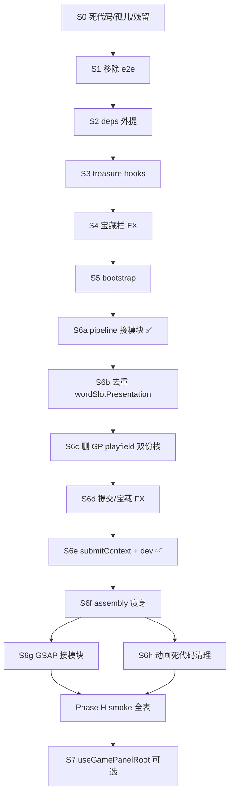

# GamePanel 架构补充计划（v3-supplement）

> 状态：**编码完成，待 Phase H 手测**（2026-06-25；**历史完成点 GP 4526 行**；**v4 起点 GP 4407 行**；S0～S6 / S6g / S6h / S6f ✅；`find-dead-imports` **0**；`npm test` **167/167**；`npm run build` ✅；Phase H smoke + `game-panel-boundary.mdc` 已由 **v4 R0** 更新基线行数；完整 smoke 仍待用户）
> 前置：`design/gamepanel-architecture-plan-v3.md` **v3.6.26**（Phase G 已完成，Phase H smoke 未跑）
> 唯一起点：备份 `word_master_bak/v3-supplement-baseline-2026-06-25/word_master_demo`
> 基线行数：`GamePanel.vue` **8,495** 行 → S1 后 **8,164** 行（−331）；`npm test` **167/167**

## 0. 本计划与前序 v3 的关系

| 来源 | 本计划承接项 |
|---|---|
| v3 Phase H | §1～§13 手测 smoke 全表、`game-panel-boundary.mdc` 终态基线 |
| v3 §8 备份表 | E4.1～G3.6 多段「待用户建」→ 本计划 **S0 前** 已建 supplement 基线；**每子任务完成即备份一行**（§1.1） |
| v3 行数软目标 ~2,500 | **不作为本计划硬阻断**；realistic 目标见 §4 |
| 上轮评估（对话 2026-06-25） | 死代码 / e2e 移除 + GP 继续垂直切片 |

**本计划不做的事**（仍属 v3 范围外或另开）：

- 词义层 4 props → `session.playfield` inject
- 把 `useGameState` 整块迁入 `createRunStore`（仅换文件，不优先）
- 修改 `changelog/`（除非用户明确要求）

---

## 1. 备份记录

### 1.1 子任务备份规程（强制）

**每完成一项子任务（表格中带 ✅ 的步骤）立即执行**，不得堆到 Phase 末：

1. 跑 `npm test`，确认通过后再备份。
2. 复制到 `C:\Users\2020\Documents\GodotProjects\word_master_bak\v3-supplement-{子任务ID}-{YYYY-MM-DD}\`：
   - 至少：`src/components/GamePanel.vue`
   - 本步改过的：`src/runSession/**`、新建模块等
   - 根目录写 `BACKUP.md`：`子任务 ID`、日期、`GamePanel.vue` 行数、`npm test` 结果、一句话变更摘要
3. 在本表 **追加一行**（禁止只写「待建」而不复制文件）。
4. **禁止**用 `git checkout -- GamePanel.vue` 或按行删除脚本「修 GP」；回滚只从本表路径 `Copy-Item` 恢复。

命名示例：`v3-supplement-s6b4-2026-06-25`、`v3-supplement-s6c1b-2026-06-25`。

### 1.2 事故：GP 行数回退（2026-06-25）

| 时间点 | GamePanel 行数 | 说明 |
|---|---:|---|
| S2～S6a 后 | **7,797** | deps / FX / bootstrap 外提完成 |
| **S6b 完成后（工作区）** | **7,533** | GP 去重 `useWordSlotPresentation`（约 −260） |
| 误 `git checkout -- GamePanel.vue` | **~16,962** | 未提交 GP **全部丢失**（未进 git、未备份） |
| 从 G3.4 备份恢复 | **8,572** | `word_master_bak/v3-phase-G3.4-G3.6-in-progress-2026-06-25` |
| 当前（S6c.1b + bridge） | **8,429** | runSession 侧改动保留；GP 仍缺 S6b 去重 + S6c.3 |

**为何你记得 ~7000 行、现在又 ~8400？**  
计划里 **7,533** 是 S6b 完成后的真实进度，但**从未写入 `word_master_bak`**（表中一直是「备份待建」）。事故后只能从 **8572 行的 G3.4** 恢复，相当于**跳过了 S6b 在 GP 上减掉的 ~260 行**，再叠加 GP 内仍保留的 playfield 双份栈（S6c 未删完）。`runSession/` 外提模块仍在，所以测试仍绿，但 **GP 单体行数回退了约 900 行**。

**恢复路径**：按序 **S6b-redo（→ ~8170）→ S6c.3（→ ~7400）**；目标仍见 §4。

### 1.3 备份表

| Phase / 子任务 | 备份路径 | GamePanel 行数 | 日期 |
|---|---|---:|---|
| **S 起点** | `../word_master_bak/v3-supplement-baseline-2026-06-25/word_master_demo` | 8,495 | 2026-06-25 |
| G3.4（事故恢复源） | `../word_master_bak/v3-phase-G3.4-G3.6-in-progress-2026-06-25/word_master_demo` | 8,572 | 2026-06-25 |
| S0 | （**待补**：代码 8,164，备份未建） | 8,164 | 2026-06-25 |
| S1 | （**待补**） | 8,164 | 2026-06-25 |
| S2～S5 + S6a | （**待补**） | 7,797 | 2026-06-25 |
| **S6b（工作区）** | **❌ 未备份，已丢失** | 7,533 | 2026-06-25 |
| **S6c.1b** | `../word_master_bak/v3-supplement-s6c1b-2026-06-25/` | 8,429 | 2026-06-25 |
| **S6b-redo** | `../word_master_bak/v3-supplement-s6b-redo-2026-06-25/` | 8,075 | 2026-06-25 |
| **S6c.3** | `../word_master_bak/v3-supplement-s6c3-2026-06-25/` | 7,357 | 2026-06-25 |
| **S6c.4** | `../word_master_bak/v3-supplement-s6c4-2026-06-25/` | 6,659 | 2026-06-25 |
| **S6d** | `../word_master_bak/v3-supplement-s6d-2026-06-25/` | 6,170 | 2026-06-25 |
| **S6e** | `../word_master_bak/v3-supplement-s6e-2026-06-25/` | 5,682 | 2026-06-25 |
| **S6f.1** | `../word_master_bak/v3-supplement-s6f1-2026-06-25/` | 5,605 | 2026-06-25 |
| **S6h.1～4** | `../word_master_bak/v3-supplement-s6h4-2026-06-25/` | 5,425 | 2026-06-25 |
| **S6g.1** | `../word_master_bak/v3-supplement-s6g1-2026-06-25/` | 5,335 | 2026-06-25 |
| **S6g.2～4 + S6h.5** | `../word_master_bak/v3-supplement-s6g4-2026-06-25/` | 4,923 | 2026-06-25 |
| **S6f.2～3 + S6g.5** | `../word_master_bak/v3-supplement-s6f2-s6g5-2026-06-25/` | 4,526 | 2026-06-25 |
| H | Phase H 验收完成后建 | — | — |

路径约定：`C:\Users\2020\Documents\GodotProjects\word_master_bak\`（与 v3 §8 一致）。

---

## 2. 总目标

1. **删干净**：GamePanel 死 import、仓库内无人 import 的孤立模块、事故残留临时文件。
2. **去 e2e**：运行时 `?e2e=1` / `VITE_E2E`  harness、相关脚本与 devDependency，不再维护自动化拼词/购货 API。
3. **继续瘦 GP**：按风险从低到高迁出 deps / FX / bootstrap / playfield presentation，**单文件目标 ~6,000～6,500 行**（realistic）；可选终态 `useGamePanelRoot.js` 托管壳层逻辑、GP 仅 template + 一行调用（~80 行 SFC）。
4. **收束 v3**：跑完 `gamepanel-split-smoke.md` §1～§13，更新 boundary 规则。

---

## 3. 实施约束（继承 v3 §3～§5，补充）

1. 顺序：**S0 → S1 → S2… → 每切片 smoke 子集 → Phase H 全表**。
2. 禁止 batch patch / 按行号拼接 `GamePanel.vue`（`patch-gamepanel-*` 脚本本计划完成后删除）。
3. 每切片闭环：审计 → 单模块迁出 → `npm test` → **备份（§1.1）** → 债务 grep。
4. **禁止**对 `GamePanel.vue` 及正式源码使用 extract/patch/rebuild/按行拼接类脚本（`extract-gp-assembly-deps.mjs`、`patch-gamepanel-*`、`restore-gamepanel-utf8.mjs` 等）；S2～S6 仅用手动小步编辑（`StrReplace` / 读 surrounding code 后写新模块）。
5. e2e 移除后：**不得**保留 `isE2eMode()` 空壳或 dead branch；相关 import 一并删。
6. 删孤立文件前必须用 §8 孤儿扫描 **0 入站引用**（测试文件引用算消费者；`treasure_*.js` 等 catalog 动态加载视为假阳性，勿删）。

---

## 4. 行数预期（realistic）

| 阶段 | GamePanel.vue 约行 | 说明 |
|---|---:|---|
| 基线 | 8,495 | v3.6.26 |
| S0 死 import + 注释块 | −30～−80 | `find-dead-imports` 当前 **21** 条 |
| S1 e2e 移除 | −350～−450 | GP ~8084～8464 harness + 分支；App 等另计 |
| S2 deps 外提 | −350（GP 内） | 逻辑迁至 `buildGamePanelAssemblyDeps.js` |
| S3 treasure shell hooks | −180～−220 | |
| S4 宝藏栏 FX | −800～−1,200 | |
| S5 bootstrap 体 | −150～−250 | |
| S6 playfield presentation | −1,200～−2,000 | 最大块，分 S6a/S6b |
| **S0～S6 后 realistic** | **~5,100～5,500** | 含 S6g 去重 + S6h 死代码清理 |
| S7（可选）`useGamePanelRoot` | GP **~80**，根文件 ~6k | 仅改善 SFC 行数，总复杂度不变 |

---

## Phase S0 — 死代码与残留清理

### S0.1 GamePanel 死 import（已审计 2026-06-25）

运行：`node scripts/find-dead-imports.mjs src/components/GamePanel.vue`

当前 **21** 条待删（删前确认非 type-only 误报）：

```text
packDeckOfferFlyOriginRectFromEl, rollRandomBigramFromDictionary, createWobbleHighlightTimeline,
requestCloudSync, clearSlotRunProgress, rollPackOfferStock, resolveShopOfferEffectivePrice,
applyRandomSaleToOfferRow, applyRandomSaleToShopStockRows, getShopTreasureAccessoryPriceAdd,
rollShopTreasureAccessoryId, filterTreasureDefsForPool, normalizeTreasureDescription,
isVowelLetterWithMask, parseChapterFromLevelId, hasProbabilityDoubler, applyWalletDeltaClamped,
runLengthDowngradeShopLikeFx, buildVoucherShopOfferRow, rollShopVoucherOfferDef, DECK_PREVIEW_KEY
```

- [ ] 删除上述 import；若符号确已不用，删对应死函数（若有）。
- [ ] 复查 `find-dead-imports` → **0**。
- [ ] `npm test` + `npm run build`。

### S0.2 仓库孤儿模块扫描

新建 **`scripts/find-orphan-modules.mjs`**（本计划首批交付物之一）：

- 扫描 `src/**/*.js`（排除 `*.test.mjs`、明确测试目录）。
- 入站引用：静态 `import`/`export from`/动态 `import()`/字符串路径（保守）。
- 输出：0 入站且非 entry（`main.js` 链可达）的候选。

**已知高置信孤儿 / 应删残留**（执行前再跑扫描确认）：

| 路径 | 原因 |
|---|---|
| `.cursor-tmp-*.vue`、`.cursor-recovered-gamepanel.vue`、`.cursor-patch-mount.txt` | 编码事故临时文件（v3 §2） |
| `src/components/GamePanel.vue.bak-encoding-repair` | 修复中间件 |
| `src/runSession/_gp-assembly-core.txt` | 仅 `rebuild-gp-assembly.mjs` 消费 |
| `src/runSession/_gp-assembly-deps-snippet.txt` | 仅 patch 脚本消费 |
| `src/runSession/_gp-deps-keys.json` | 生成物，无 runtime 引用 |

**一次性迁移脚本**（S1/S7 完成后删，避免误用）：

```text
scripts/patch-gamepanel-g3-assembly.mjs
scripts/patch-gamepanel-scoring-anim.mjs
scripts/fix-gamepanel-template.mjs
scripts/generate-gp-assembly.mjs
scripts/rebuild-gp-assembly.mjs
scripts/reorder-gp-assembly.mjs
scripts/restore-gamepanel-utf8.mjs  （已 disabled，整文件删除）
scripts/check-gp-assembly.mjs       （若仅服务上述脚本）
scripts/extract-submit-scoring-anim.mjs  （审计后）
```

- [ ] 实现并跑 `find-orphan-modules.mjs`。
- [ ] 删扫描 + 上表确认的孤儿/残留。
- [ ] `npm test` + `npm run build`。
- [ ] 建 **S0 备份**。

---

## Phase S1 — 移除 E2E 全链路

> 用户决策：**不再需要** URL `?e2e=1` 自动化 harness 与 Playwright 拼词/购货脚本。

### S1.1 运行时模块（删除整目录）

```text
src/e2e/isE2eMode.js
src/e2e/registerGameTestHarness.js
src/e2e/registerAppTestHarness.js
src/e2e/gridWordFinder.js
src/e2e/e2ePickStrategy.js
src/e2e/e2eBossRules.js
src/e2e/e2eShopAutomation.js
```

### S1.2 仓库根 `e2e/`（删除或归档）

```text
e2e/run-auto-play.mjs
e2e/static-content-audit.mjs
e2e/reports/**   （报告产物，不保留）
```

### S1.3 `package.json`

- [ ] 删除 scripts：`e2e`、`e2e:audit`、`e2e:play`。
- [ ] 评估删除 **`scripts/adb-run-end-repro.mjs`** 与 script `adb:run-end-repro`（依赖 `window.__GAME_TEST__` / harness；与 e2e 同撤）。
- [ ] 若无其他 Playwright 消费者，删除 devDependency **`playwright`**，跑 `npm install`。

### S1.4 消费方改法（删 import + 分支，不保留 stub）

| 文件 | 当前 e2e 用途 | 改法 |
|---|---|---|
| `src/components/GamePanel.vue` | `mountE2eHarnessIfNeeded`、`e2e*` 函数 ~8084～8298；`isE2eMode()` 跳过 intro/grid | 删整块 + 分支改回正常路径 |
| `src/App.vue` | `registerAppTestHarness`、`isE2eMode()` 跳过 TapTap ready / 隐私 | 删 harness；ready 逻辑仅保留真实条件 |
| `src/composables/useTapTapAuth.js` | `bypassAuth = … \|\| isE2eMode()` | 删 e2e 绕过 |
| `src/privacy/privacyConsent.js` | native 且非 e2e 才展示 | 改为仅 `Capacitor.isNativePlatform()` |
| `src/save/cloudSave/cloudSaveSync.js` | 多处 `!isE2eMode()` | 删 guard，恢复常规定时同步 |
| `src/platform/haptics.js` |  e2e 关触觉 | 删 `isE2eMode` 判断 |
| `src/runSession/runSessionTypes.js` | JSDoc `buildE2eHarness` | 删文档字段 |
| `design/dev-console.md` | E2E 章节 | 删或改「已移除」 |

### S1.5 GamePanel 内 e2e 专用符号（grep 验收应为 0）

```text
isE2eMode|mountE2eHarness|disposeE2eHarness|e2eCanBuyShopOffer|getE2eShopSnapshot
e2eBuyShopOfferById|e2eAutoSpellTarget|e2eAutoPackPickOnce|getBossPlayContextForE2e
registerGameTestHarness|__GAME_TEST__
```

### S1.6 验证

- [ ] 全仓库 grep 上表 **0 命中**（`.apk-analysis*`、`dist` 可忽略）。
- [ ] `npm test` + `npm run build`。
- [ ] 手测：新局 intro 正常（原 `isE2eMode()` skip 路径已删）。
- [ ] 建 **S1 备份**。

---

## Phase S2 — `buildGamePanelAssemblyDeps` 外提

**目标**：GP 内不再存在 ~363 行 deps 字典函数。

| 步骤 | 动作 | 状态 |
|---|---|---|
| S2.1 | 新建 `src/runSession/buildGamePanelAssemblyDeps.js` | ✅ |
| S2.2 | GP `...buildGamePanelAssemblyDeps({ COLS, ROWS, … })` 一行调用 | ✅（359 键 shorthand 仍在 GP） |
| S2.3 | grep：GP 内无 `function buildGamePanelAssemblyDeps` | ✅ |
| S2.4 | test + smoke §1～3 | ✅ test/build |

预期：映射逻辑外提；GP shorthand 块 **S8** 再分组。

---

## Phase S3 — 宝藏 controller 壳层 hooks 外提

| 步骤 | 动作 | 状态 |
|---|---|---|
| S3.1 | 新建 `src/runSession/buildTreasureRunShellHooks.js` | ✅ |
| S3.2 | GP `hooks: buildTreasureRunShellHooks({ … })` | ✅ |
| S3.3 | smoke §5 + §8 | 待 Phase H |

---

## Phase S4 — 宝藏栏 FX 编排迁出

| 步骤 | 动作 | 状态 |
|---|---|---|
| S4.1 | 新建 `src/game/ownedTreasureBarFx.js` | ✅ |
| S4.2 | GP 薄转发 + `createOwnedTreasureBarFx` | ✅ |
| S4.3 | grep GP 无大块 `playOwnedTreasure*` 实现 | ✅ |
| S4.4 | smoke §2 + §5 | 待 Phase H |

---

## Phase S5 — Bootstrap 启动体

| 步骤 | 动作 | 状态 |
|---|---|---|
| S5.1 | `src/runSession/gamePanelBootstrapRunners.js` | ✅ |
| S5.2 | GP `buildGamePanelBootstrapDeps()` + 薄包装 | ✅ |
| S5.3 | smoke §6 | 待 Phase H |

---

## Phase S6 — Playfield presentation 域（分步）

### S6a — 拼词纯逻辑接已有模块 ✅

| 动作 | 状态 |
|---|---|
| GP 改调 `submitWordPipeline.js`（`createSubmitWordResolver` 等） | ✅ |
| GP 改调 `useWordSlotPresentation.js` 导出（`buildTilePresentationIndex` / `computeFlyBackTilePresentation`） | ✅ |
| `bossSoftWordViolationPreview` → `previewBossSoftWordViolation` | ✅ |
| grep GP 无大块 `resolveWordFromEffectiveParts` / `buildTilePresentationIndex` 实现 | ✅ |

### S6b — 去重 `useWordSlotPresentation`

**问题**：`useGamePanelSessionAssembly` 内已创建 `wordSlotPresentation`，GP 仍维护平行 computed（~200 行）并传入 deps（assembly 侧未消费）。

| 步骤 | 动作 | 目标文件 | 约 −行 | 状态 |
|---|---|---|---|---|
| S6b.1 | assembly `playfield.render` 改接 `wordSlotPresentation.gridTile*`；submit 改接 `wordSlotPresentation.tilePresentationInResolvedWord` | `useGamePanelSessionAssembly.js` | — | ✅ runSession |
| S6b.2 | 删 GP 死代码 `flyingLettersForRender`；`effectiveFormulaTiles` 改接 `wordSlotPresentation` | `GamePanel.vue` | ~50 | ✅ |
| S6b.3 | deps 注入 `wordSlotPresentation`（assembly 不再二次创建） | `buildGamePanelAssemblyDeps.js` + assembly | ~10 | ✅ |
| S6b.4 | GP 提前 `useWordSlotPresentation`，删重复 computed/纯函数 | `GamePanel.vue` + assembly | ~354 | ✅ redo |
| S6b.5 | smoke §1～3 子集 | — | — | 待 H |

### S6c — 删 GP 遗留 playfield 栈（✅ 2026-06-25）

**问题**：GP 与 `usePlayfieldController` 双份 playfield 栈；UI 已走 `InRunPlayfield` → controller。

| 步骤 | 动作 | 状态 |
|---|---|---|
| S6c.0 | 恢复 GP：从 `v3-phase-G3.4` 备份（8572 行）+ 接 `buildGamePanelAssemblyDeps` 外提 | ✅ |
| S6c.1 | assembly bridge：`getPlayfieldFlySnapshotFromBridge` / `updateSlotPositionsViaBridge`；discard/submit 青铃与 `updateSlotPositions` 改接 controller；`runSaveBridge` 飞字状态改接 controller；青铃回调迁入 assembly | ✅ |
| S6c.1b | 删 GP 重复 word aux UI 块（~130 行，UI 已走 `playfieldController`） | ✅ |
| S6c.1b 备份 | `v3-supplement-s6c1b-2026-06-25` | ✅ |
| **S6b-redo** | 重做 S6b.2～S6b.4（GP 侧 presentation 去重，−354 行） | ✅ |
| S6c.2 | `gpPlayfieldBridge` 转发 RAF / 飞字 snapshot / DOM | ✅ |
| S6c.3 | 删 GP 重复 slotRaf / fly-in / fly-out / 死 pointer 块（−718 行；8075→7357） | ✅ |
| S6c.3 备份 | `v3-supplement-s6c3-2026-06-25` | ✅ |
| S6c.4 | 删 GP 遗留 `useTileDrag` + slot remap / grid 渲染 duplicate（−698 行；7357→6659） | ✅ |
| S6c.4 备份 | `v3-supplement-s6c4-2026-06-25` | ✅ |
| S6d | 接入 `ownedTreasureBarFx` / `submitTileLeaveAnim`；新建 `inRunUpgradePlayback`、`treasureDestroyFx`；扩展 `treasureHourglassRuntime`（−489 行；6659→6170） | ✅ |
| S6d 备份 | `v3-supplement-s6d-2026-06-25` | ✅ |
| S6e | `playfieldSubmitContext.js` + `gamePanelDevCommands.js`；GP dev 块外提 + `playfieldActionsRef`/`devCommandsRef` wiring；修复拼词 pipeline 损坏（−488 行；6170→5682） | ✅ |
| S6e 备份 | `v3-supplement-s6e-2026-06-25` | ✅ |
| S6f.1 | GP 改接 `buildTreasureRunShellHooks`（S3-redo）+ `gamePanelBootstrapRunners`（S5-redo）；−77 行（5682→5605） | ✅ |
| S6f.1 备份 | `v3-supplement-s6f1-2026-06-25` | ✅ |
| **S6h.1～4** | 删 GP 动画死代码（pack deck offer fly / spell deck adds / wobble 簇；−180 行） | ✅ |
| S6h 备份 | `v3-supplement-s6h4-2026-06-25` | ✅ |
| **S6g.1** | spellCast 直引 `shopOfferFlyAnim.animatePackTileFlyToDeck`；删 GP 副本（−90 行） | ✅ |
| S6g.1 备份 | `v3-supplement-s6g1-2026-06-25` | ✅ |
| **S6g.2** | `createGridDropAnim` 接入 assembly + lifecycle bind；删 GP 下落簇（−~230） | ✅ |
| **S6g.3** | `animateTreasureFrameFly` 直引 `shopOfferFlyAnim`；删 GP 副本（−~105） | ✅ |
| **S6g.4** | 结算 `createShopWalletGainAnim`；删 GP playWalletHeaderGainAnim（−~65） | ✅ |
| **S6h.5** | find-dead-imports → **0**（−23 import / ~12 行） | ✅ |
| S6g.2～4 备份 | `v3-supplement-s6g4-2026-06-25` | ✅ |
| S6f.2～S6f.3 | assembly deps 按域分组（见 §S6f 表） | ✅ |
| S6g.5 | shopTreasurePurchaseFx FX 接线（`onTreasurePurchase` 仍留 GP） | ✅（FX 部分） |

### S6f — assembly 接线瘦身（进行中）

| 步骤 | 动作 | 约 −行 | 状态 |
|---|---|---:|---|
| S6f.1 | GP 改接 `buildTreasureRunShellHooks` + `gamePanelBootstrapRunners` | 77 | ✅ |
| S6f.2 | `buildGamePanelAssemblySource.js`：deps 字典按域分组（grid/shop/treasure/anim），GP 只保留 `buildGamePanelAssemblySource({ … })` 调用 | 可读性；行数略减 | ✅ |
| S6f.3 | presentation / fly 一律从 `wordSlotPresentation` / `playfieldController` getter 取，削减 assembly 平铺键 | ~30 | ✅ |

### S6g — 商店 / 棋盘 GSAP 去重接模块（分离）

**背景**：G3.4 恢复 + S6 未覆盖商店飞入域 → `src/game/*.js` 已有实现，GP / assembly 仍注入**本地副本**。原则：**先改 controller / assembly 接模块 → smoke 子集 → 再删 GP 副本**（禁止只删 GP 不接线）。

| 步骤 | 迁出 / 接模块目标 | GP 内符号（当前副本） | 实际 live 路径 | 约 −行 | smoke | 状态 |
|---|---|---|---|---:|---|---|
| S6g.1 | `shopOfferFlyAnim.js` | `animatePackTileFlyToDeck` | `useSpellCastController` → `shopOfferFlyAnim.js`（已直引） | ~90 | §8 spell 入字母库 | ✅ |
| S6g.2 | `gridDropAnim.js`（`createGridDropAnim`） | `runGridDropAnimation` | assembly `createGridDropAnim` + lifecycle bind | ~230 | §1 补牌、§3 提交 | ✅ |
| S6g.3 | `shopOfferFlyAnim.js` | `animateTreasureFrameFly` | GP / packPick → `shopOfferFlyAnim.js` | ~105 | §4 购宝、§8 pack | ✅ |
| S6g.4 | `shopWalletGainAnim.js` | `playWalletHeaderGainAnim` | 结算 `createShopWalletGainAnim`（商店仍用 controller 内 factory） | ~65 | §9～10 结算 | ✅ |
| S6g.5 | 新建 `shopTreasurePurchaseFx.js`（可选） | `onTreasurePurchase`、`playTreasureGrantPopAtSlotIndex`、`waitForOwnedTreasureSlotEl` 编排块 | assembly 直引 `createShopTreasurePurchaseFx`；`onTreasurePurchase` 仍绑 GP ref | ~90 | §4、§5 | ✅（FX） |

**S6g 合计 realistic**：GP **5605 → ~5100～5300**（若 S6g.1～4 全做）。

### S6h — GP 动画死代码清理（低风险清理）

**背景**：下列函数在 GP **仅定义、不在 `gamePanelAssemblySource` / 内部 live 链**；运行时已由 `src/game/*` 或 controller 内副本承担。**删前必须 grep 确认 0 引用**。

| 步骤 | GP 内符号 | 说明 | 约 −行 | 风险 | 状态 |
|---|---|---|---:|---|---|
| S6h.1 | `animatePackDeckOfferFlyToDeck` | live：`usePackPickController` → `shopOfferFlyAnim.js` | ~75 | 低 | ✅ |
| S6h.2 | `animateSpectralDeckAddsFromSpellIcon` | live：`useSpellCastController.js` 内同名 | ~60 | 低 | ✅ |
| S6h.3 | `animateSpellDeckAddsFromOfferSlots` | 仅被 S6h.2 死簇调用 | ~15 | 低（随 S6h.2） | ✅ |
| S6h.4 | `wobbleGameTreasureSlots`（GP 内） | GP 内 0 调用；spell 路径用 controller 内版 | ~15 | 低 | ✅ |
| S6h.5 | 审计扩展 | `find-dead-imports` → **0**；GP 内无 `runGridDropAnimation` / `animateTreasureFrameFly` / `playWalletHeaderGainAnim` 副本 | — | — | ✅ |

**注意**：S6h 与 S6g **勿并行改同一符号**——例如 S6g.1 改接 `animatePackTileFlyToDeck` 后再删 GP 版；**不要**与 S6h.1 混淆 `animatePackDeckOfferFlyToDeck`（无 `Deck` 后缀不同函数）。

### S6e — 小逻辑 + dev（已完成）

| 迁出目标 | 内容 | 约 −行 |
|---|---|---:|
| `playfieldSubmitContext.js`（新建） | `buildSubmitAfterLettersContext` | ~30 |
| `playfieldWordAux.js`（已有，经 `usePlayfieldController`） | mark/swap / 青铃；GP 仅 `playfieldActionsRef` 桥接 | ~0（S6c 已删重复栈） |
| `src/dev/gamePanelDevCommands.js` | `jumpToLevelDev`、`startScreenshotPresetDevTest`、控制台 hooks 等 | ~430 |

**S6 合计 realistic**（含 S6g/S6h 待做）：GP **7,797 → ~5,100～5,500**（不含 S7）。

---

## Phase S7（可选）— `useGamePanelRoot.js` 壳层托管

**触发条件**：S0～S6 完成且仍希望 GP SFC **&lt;200 行**。

```text
useGamePanelRoot.js   // props, emit, 全部 ref, 装配, provide, bootstrap
GamePanel.vue         // template + const root = useGamePanelRoot(props, emit)
```

- 不减少总 JS 行数，仅满足 boundary「AI 不读巨型 SFC」。
- 与 v3 §12 软目标 ~2,500 仍可能差距大（根文件仍 ~6k）。

---

## Phase H — v3 未完成验收（本计划最后执行）

全表：`design/gamepanel-split-smoke.md` §1～§13（当前 **全部未勾选**）。

| Smoke § | supplement 后重点 |
|---|---|
| 1～3 | S6 playfield |
| 2 | S4 FX |
| 4 | S3 hooks + shop（无 e2e 购货） |
| 5 | S3/S4 宝藏 |
| 6 | S5 bootstrap |
| 7 | lifecycle reroll（v3 E4.2） |
| 8 | spell/packPick |
| 9～10 | F2 runEnd + settlement |
| 11 | G3.5 pause/dev |
| 12 | 动画设置 |
| 13 | G3.2 成就 |

**完成标准**：

- [ ] smoke 全表勾选或记录已知环境限制
- [ ] `npm test` 167/167、`npm run build`
- [ ] §9 债务 grep 通过
- [ ] 更新 `.cursor/rules/game-panel-boundary.mdc` 行数基线
- [ ] 建 **Phase H 备份**

---

## 8. 债务 grep 清单（每切片叠加 v3 §6）

```text
# v3 回归（应持续 0）
runSubmitScoringSequence|const shopSession = \{|function buildViewContext\(
usePlayfieldController\(|useSubmitWordController\(

# S1 e2e（完成后 0）
isE2eMode|__GAME_TEST__|registerGameTestHarness|mountE2eHarness

# S2～S6 GP 内（完成后 0）
function buildGamePanelAssemblyDeps\(
function ownedTreasureHookFxBridge|function playOwnedTreasureBubbleFx
function resolveWordFromEffectiveParts|function startGamePanelFromRestoredSave

# S6g 后 GP 内不应再存在与 src/game 同名的飞入/下落实现
^async function animatePackDeckOfferFlyToDeck|^function runGridDropAnimation\(
^async function animatePackTileFlyToDeck|^async function animateTreasureFrameFly\(
^async function animateSpectralDeckAddsFromSpellIcon

# 孤儿脚本（S0 完成后 0）
patch-gamepanel-|restore-gamepanel-utf8
```

---

## 9. 推荐执行顺序（总览）



**原则**：S1 尽早做（减少 GP 内 ~400 行与跨文件分支）；**S6h（纯删）可在 S6g 各步之前或之后，但勿与 S6g 改接同一符号**；Phase H 在 S6f～S6h 稳定后一次性手测。

---

## 10. 文档与规则同步

| 文件 | 时机 |
|---|---|
| `design/gamepanel-architecture-plan-v3.md` | S 全部完成后，文首加「主线已迁至 v3-supplement；H 已完成」 |
| `design/gamepanel-controller-wiring-matrix.md` | S2/S6 改 assembly 或 playfield 边界时更新 |
| `.cursor/rules/game-panel-boundary.mdc` | Phase H 后更新行数；若 S7 落地则改「默认改 `useGamePanelRoot.js`」 |
| `design/dev-console.md` | S1 删 e2e 章节 |

---

## 11. 版本记录

| 版本 | 日期 | 说明 |
|---|---|---|
| v3-supplement.5 | 2026-06-25 | **S6g.2～4** + **S6h.5**；GP **4,923** 行；fix assembly 未定义 gridDropAnim 引用 + lifecycle bind |
| v3-supplement.4 | 2026-06-25 | **S6h.1～4** 删 GP 动画死代码（−180）；**S6g.1** spellCast 直引 `shopOfferFlyAnim.animatePackTileFlyToDeck`（−90）；GP **5,335** 行 |
| v3-supplement.3 | 2026-06-25 | S6e/S6f.1 完成；新增 **S6g**（GSAP 接模块）与 **S6h**（动画死代码清理）任务表；GP **5,605** 行 |
| v3-supplement.2 | 2026-06-25 | S2～S6a 完成；S6 细化为 S6b～S6f + S8 assembly 分组；GP **7,797** 行 |

---

## 12. 交叉引用

- 主计划：`design/gamepanel-architecture-plan-v3.md`
- 接线矩阵：`design/gamepanel-controller-wiring-matrix.md`
- 手测：`design/gamepanel-split-smoke.md`
- 边界规则：`.cursor/rules/game-panel-boundary.mdc`
