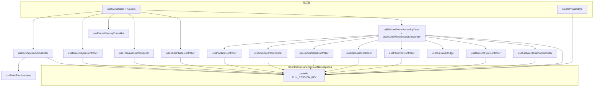
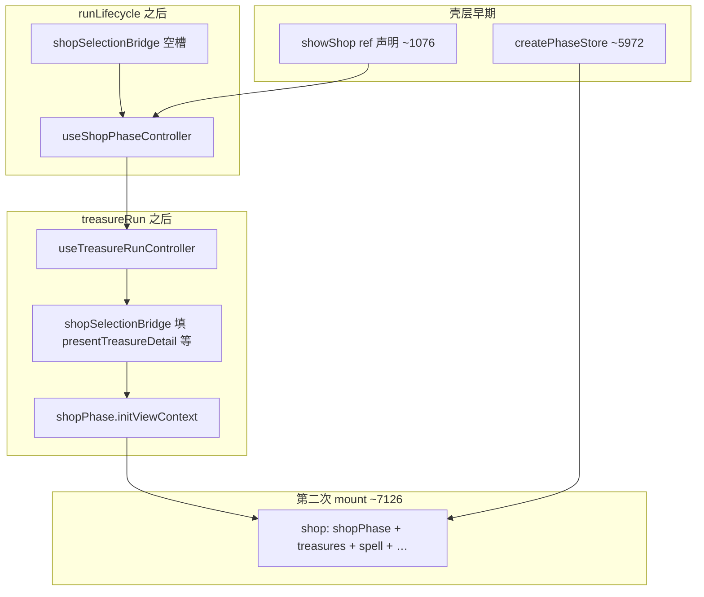

# GamePanel 架构拆分计划（v3.6.26）

> 状态：Phase G 已完成；**后续工作见** [`gamepanel-architecture-plan-v3-supplement.md`](gamepanel-architecture-plan-v3-supplement.md)（死代码 / e2e 移除 / GP 续拆 / Phase H smoke）
> 唯一起点：当前工作树中的 `src/components/GamePanel.vue`
> 当前总行数：**8,495**（2026-06-25 当前工作树）
> 当前阶段：Phase G **G3.3～G3.6 已完成** / Phase H smoke 待跑
> 接线矩阵：`design/gamepanel-controller-wiring-matrix.md`（v3.6.26，与本文同步维护）

## 0. 本计划的作用

这份计划只服务于一件事：把 `GamePanel.vue` 从巨型单文件逐步拆成稳定、可验证、可回退的壳层。

优先级从高到低如下：

1. 保住现有行为。
2. 保住可恢复性。
3. 按垂直切片迁移职责。
4. 最后才追求行数下降和结构美观。

如果这几项发生冲突，以行为稳定和可恢复性为最高优先级。

## 1. 当前真实状态

### 1.1 基线

- `src/components/GamePanel.vue` 当前 **8,495** 行（2026-06-25 当前工作树；G3.6 后；G3.4/G3.5/G3.6-in-progress 曾为 8,572；G3.2 后 9,034；G2 后 9,783；E4.3 CSS 清理前曾为 10,347）。
- 行数构成（2026-06-25 G3.1 后审计，近似）：模板 **41** / import **~453** / run 级 ref + 域 helper **~5,100** / `buildGamePanelAssemblyDeps` **~350** / assembly 调用 + 解构 **~50** / 成就 / pause glue **~200** / settlement + 域 helper + FX **~3,200** / hydrate **~113**。
- 当前构建可通过：`npm run build`
- 当前构建可通过：`npm.cmd run build`（2026-06-25 再复核通过）
- 当前 Node 测试：**167/167**（2026-06-25 G3.6 后复核通过）
- 死 import（`find-dead-imports.mjs`）：**0**

### 1.2 已完成进度

- Phase 0：完成
- Phase A：完成
- Phase B：完成
- Phase C：完成
- Phase D：完成
- Phase E：收尾（E4.1～E4.2 已完成；E4.3 无消费者 CSS 已删；**仅剩 E4 外部备份待用户建**）
- Phase F：主体收束（F1、F2、F3 已完成；settlement 仍经 props，非 v3 阻断）
- Phase G：**G1～G3.6 已完成**（壳层 ~2,500 行软目标未达成，属预期；见 §23.1）

### 1.3 已完成的关键拆分

- 已接入 `InRunShopPhase.vue`
- 已接入 `InRunPlayfield.vue`
- 已接入 `RunEndFlowHost.vue`
- 已接入 `FirstWordTutorialHost.vue`
- `WordDefinitionLayer` 已迁入 `InRunPlayfield.vue`
- `RunOverlayHost.vue` 已接管多类浮层
- `StageSettlementLayer.vue` 已恢复正常中文文本

## 2. 本次事故复盘

### 2.1 事故结论

本轮出现的乱码不是单纯显示问题，而是“错误编码的中间文件被再次当作恢复源写回正式文件”。

最危险的链路是：

1. `.cursor-*` 临时文件中已经存在错码中文。
2. `scripts/restore-gamepanel-utf8.mjs` 按固定假设读取临时文件。
3. 脚本又把已经错码的字符串写回 `GamePanel.vue`。
4. 结果是乱码被正式固化进项目文件。

### 2.2 本次确认受影响的文件

正式文件：

- `design/gamepanel-architecture-plan-v3.md`
- `design/gamepanel-controller-wiring-matrix.md`
- `src/components/run/StageSettlementLayer.vue`
- `scripts/restore-gamepanel-utf8.mjs`

中间残留文件：

- `.cursor-tmp-gamepanel-stash.vue`
- `.cursor-tmp-gamepanel-479555b.vue`
- `.cursor-tmp-head-gp.vue`
- `.cursor-recovered-gamepanel.vue`

## 3. 防再犯规则

以下规则自本版本起为强制规则：

1. 不得再把 `.cursor-*` 临时文件当作正式恢复源。
2. 不得运行任何“按假定编码批量重写正式源码”的脚本，除非先做只读预览并确认输出。
3. 一旦发现乱码，先做来源审计，再决定修复方式；禁止边猜边覆盖正式文件。
4. 编码修复优先顺序必须是：
   - 先查 `git`
   - 再查外部备份
   - 再做可逆转码预览
   - 最后才允许手工重写
5. 所有恢复脚本若会写正式源码，必须默认阻止执行，除非显式解除保护。
6. 计划文档、接线矩阵、恢复脚本都属于正式资产，发现乱码后必须一并修复，不能只修源码组件。
7. 每完成一个 Phase，必须先做外部备份，再进入下一 Phase。

## 4. RunSession 命名空间（接线目标）

> 类型骨架见 `src/runSession/runSessionTypes.js`；装配见 `mountGamePanelSessionNamespaces` / `mountRunSessionNamespaces`。

| namespace | 模块 | 消费者 |
|---|---|---|
| `run` / `grid` | `useRunSession` → `createRunStore` + `useGameState` | 全局 |
| `phase` | `createPhaseStore` | 壳层 guard、controller 门禁 |
| `save` | `useRunSaveBridge` | autosave / hydrate |
| `playfield` | `usePlayfieldController` | `InRunPlayfield.vue` |
| `submit` | `useSubmitWordController` → `submitScoringAnim.js` | 提交按钮 |
| `discard` | `useGridDiscardController` | 弃牌 / remove |
| `overlayStack` | `useOverlayStackController` | `RunOverlayHost` z-index / viewContext |
| `packPick` | `usePackPickController` | `RunOverlayHost` 开包 |
| `treasures` | `useTreasureRunController` | 宝藏详情 / 全览 / 栏位重排 / 关卡 hook | **G1 已完成** |
| `spell` | `useSpellCastController` | `RunOverlayHost` 法术选格 |
| `lifecycle` | `useRunLifecycleController` | 进退关 / Boss reroll / 寻呼机 |
| `pauseOverlay` | `usePauseOverlayController` | 暂停 / 开发者选项 |
| `ui.firstWordTutorial` | `useFirstWordTutorialController` | `FirstWordTutorialHost` |
| `ui.runEnd` | `useRunEndFlowController` → `createRunEndFlow` | `RunEndFlowHost` |
| `shop` | `useShopPhaseController`（**G2 已接线**） | `InRunShopPhase.vue` |
| `assembly` | `useGamePanelSessionAssembly`（**G3.1**） | 内部：playfield/submit/spell/packPick/save/runEnd 装配；**不**对外 namespace |

**ViewContext 规则**：禁止在 `GamePanel.vue` 维护上百行 `*VIEW_KEY` 字面量；新绑定写入 controller 的 `buildViewContext()` 或挂到 `session.*`。G2 完成后 `GamePanel` 内 `const shopSession = {` 与 inline `buildViewContext()` 须为 **0 命中**（**已达成**）。

## 5. 实施约束

1. 按 Phase 顺序连续推进，除非遇到真正阻塞。
2. 不修改 `changelog/`，除非用户明确要求。
3. 不使用按行号剪切、覆盖、批量拼接 `GamePanel.vue` 的脚本。
4. 不允许一次性挂载全部 controller 后再集中删除旧实现。
5. 每个切片都必须完成这个闭环：
   - 审计旧实现
   - 接入单个消费者
   - 验证
   - 删除旧实现
   - grep 债务
   - 建恢复点
6. 新逻辑默认不再塞回 `GamePanel.vue` 大块脚本。
7. 对外部恢复脚本和临时文件一律保持怀疑，先验证再使用。

## 6. 债务 grep 清单（每切片完成后跑）

```text
# 旧计分链（应 0 命中）
runSubmitScoringSequence|submitBossToothTapeCuePlayed|collapseSubmitTranslation

# 字母库 inline（应 0 命中于 GamePanel）
deckExpandFlipTl|deckPortalZ|showDeckLayer\.value

# 层 ref 双写（GamePanel 内不应再声明 layer ref，应走 runOverlayHostRef）
treasureDetailLayerRef = ref|bossBlindRerollLayerRef = ref

# 开包双写（应 0 命中）
buildPackPickSessionFromBundle

# 首词教程过渡桥（应 0 命中）
firstWordTutorialInputGate|firstWordTutorialLifecycleBridge

# 全局 overlay z 仍留壳层（E4.1 完成后应 0 命中于 GamePanel）
dictFatalPortalZ|toastPortalZ

# 宝藏 session 内联（G1 已完成）
const treasureSession = treasureRun

# shop 双写（G2 完成后应 0 命中于 GamePanel）
const shopSession = \{|function buildViewContext\(|function rollShopStock|function onShopReroll

# 旧提交流程（应 0 命中）
submitWordLegacy
```

**2026-06-25 审计（v3.6.26）**：§6 全部 grep **0 命中**；G3.1 grep（§23.3 装配迁出）**0 命中**；G3.3～G3.5 专项 grep **0 命中**（`showScoreBubble` / settlement props / dev props）。

## 7. 当前阶段计划

### Phase E：浮层聚合

- [x] 删除 `GamePanel.vue` 中与 `usePackPickController` 重复的开包编排（~380 行）
- [x] 字母库 UI 唯一路径：`RunOverlayHost → DeckPreviewLayer`（`DECK_PREVIEW_KEY` + `RUN_SESSION_KEY`）
- [x] `GamePanel` 内字母库开关统一走 `deckPreview.openDeckLayer` / `closeDeckLayer`（不再散落写 `showDeckLayer.value`）
- [x] 修复 `playSubmitWordLetterRemoveAndRewardLeave` 中 `moneyAmount` 读取损坏
- [x] `GamePanel.vue` 内无 `deckExpandFlipTl` / `deckPortalZ` 等悬空 deck 动画引用
- [x] `useSpellCastController` 接入：`spellSession`、packPick `grant.runSpellPreviewChain`、删除 ~1,160 行 inline 法术编排
- [x] `useRunLifecycleController` 接入：关卡 reset 选项、商店离店进关、Boss blind reroll、寻呼机测验、进关 intro / 顶栏动效
- [x] `mountGamePanelSessionNamespaces({ lifecycle: runLifecycle })`
- [x] 修复关机中断后遗留的 `runEndFlow` 双写：`openRunEnd` / `abandonStandardWinRunProgressIfNeeded` / `onRunEndMainMenu`
- [x] 暂停 / 开发者选项层状态、回调与 portal glue 收口到 `usePauseOverlayController.js`
- [x] 删除 `GamePanel.vue` 中与 `useSubmitWordController` / `submitScoringAnim.js` 重复的旧 inline 计分链（`runSubmitScoringSequence` 及逐字辅助函数，约 1,440 行）
- [x] `RunOverlayHost` 暴露 `bossBlindRerollLayerRef`；`getBossBlindRerollLayer` 改走 `runOverlayHostRef`（修复 lifecycle 离店 `playClose` 悬空）
- [x] 删除 `GamePanel.vue` 中已无消费者的 overlay layer 本地 ref（`treasureDetailLayerRef` 等 5 个）
- [x] **E4.1** 把 `dictFatalPortalZ` / `toastPortalZ` 迁入 `useOverlayStackController`；`RunGlobalOverlays` inject `session.overlayStack`；删除 GamePanel → Host 6 个 props + 重复 CSS
- [x] **E4.2** `bossRerollSession` / `pagerQuizSession` 改由 `RunOverlayHost` 经 `session.lifecycle` 读取，删除 GamePanel → Host 的 2 个 props + 4 个 emit 转发
- [x] **E4.3** 删除 GamePanel 中已无消费者的旧模板块和旧辅助函数（**代码侧已完成**；E4 外部备份仍待用户建）
  - 已删 `buildDeckExpandPreviewNav`、修复 G1 误删 ref、修复 `InRunShopPhase` viewContext 字段名、`shopSession.runWalletFloor`
  - 已删整段 `<style scoped>`（~498 行）：样式已在 `InRunPlayfield` / `RunHeaderBar` / `RunEndFlowHost` / `css/game.deck-layer.css` 唯一持有

### Phase F：关卡流转与教程

- [x] 结算展示与结算动效已迁入 `StageSettlementLayer.vue` / `stageSettlementAnim.js`
- [x] `buildSettlementSnapshot.js` 接入，`GamePanel` 内联结算快照拼装已删除并补充独立测试
- [x] `useRunLifecycleController.js` 收口关卡进退（F1）
- [x] 删除 `GamePanel.vue` 中已无消费者的旧结算 CSS，样式定义仅保留在 `StageSettlementLayer.vue`
- [x] 通关发现项预览路由抽到 `runEndDiscoveryPreview.js`，删除 `GamePanel` 内重复的 run-end preview helper / 死统计计算
- [x] 结算 opening / continue / endless 接续切到 `createStageSettlementFlow`，删除 `GamePanel` 内对应 watch 与重复 glue
- [x] 首词教程 bridge 壳收口为直接函数引用，删除 `firstWordTutorialInputGate` / `firstWordTutorialLifecycleBridge`
- [x] **F3.1** `mountGamePanelSessionNamespaces({ ui: { firstWordTutorial: firstWordTutorialCtrl, … } })`；`FirstWordTutorialHost` inject 读 controller，删除 10+ 条 props
- [x] **F3.2** 删除 `isFirstWordTutorialBlockingInput` / `beginFirstWordTutorialAfterGridSettled` 可变函数占位赋值，改 `firstWordTutorialCtrlSlot` 稳定引用
- [x] **F2.1** `RunEndFlowHost`：`showRunEnd` / `runEndOutcome` / `runEndPortalStackStyle` 经 `session.ui.runEnd`（`useRunEndFlowController`）inject；模板仅 `<RunEndFlowHost ref="runEndFlowHostRef" />`
- [x] **F2.2** `onRunEndDiscoverySelect` / 无尽接续保留壳层薄 wrapper（≤15 行）；`createRunEndFlow` 逻辑经 controller 的 `flowDeps` 注入

### Phase G：壳层收束

- [x] 清理死 `import`（`find-dead-imports.mjs` → 0）
- [x] **G1** 接入 `useTreasureRunController.js`：`sharedTreasureDetail` 与 pause/spell 共用；`treasureSession = treasureRun`；删 inline 详情/重排/充能/落位/关卡 hook/提交上下文（约 440 行）
- [x] **G2** 接入 `useShopPhaseController.js`：`shopPhase` + `initShopViewContext` + `shopSelectionBridge`；删 inline `shopSession` 与 §21 双写块（约 560 行）
- [x] **G3.1** 新建 `useGamePanelSessionAssembly.js`：迁出首词教程 + controller 装配 + 第二次 mount（GamePanel **9,191** 行，-592）
- [x] **G3.2** 新建 `useRunAchievementBridge.js`：成就/收藏 glue 迁出（GamePanel **9,034** 行，-155）
- [~] **G3.3～G3.6** 见 §23（**已完成** v3.6.26：`showBundlePackBubble` 迁入 `scoreBubbleFx.js`；`useDeveloperOptionsBridge.js`；`useRunPanelBootstrap.dispose`；`RunOverlayHost` 仅 inject `pauseOverlay`）

### Phase H：验收

- [x] 全量 `npm test` 167/167（2026-06-25 G3.6 后复核）
- [x] 全量 `npm run build`
- [ ] 跑完整 smoke（清单见 `design/gamepanel-split-smoke.md` §1～§13）
- [x] 更新 `.cursor/rules/game-panel-boundary.mdc` 行数基线（v3.6.26 → **8,495** 行）
- [ ] 建立 Phase H 外部备份

## 8. 备份记录

| Phase | 备份路径 | GamePanel 行数 | 日期 |
|---|---|---:|---|
| 起点 | `word_master_bak/v3-baseline-2026-06-24/word_master_demo` | 16,962 | 2026-06-24 |
| 0 | `word_master_bak/v3-phase-0-2026-06-24/word_master_demo` | 16,962 | 2026-06-24 |
| A | `word_master_bak/v3-phase-A-2026-06-24/word_master_demo` | 15,905 | 2026-06-24 |
| B | `word_master_bak/v3-phase-B-2026-06-24/word_master_demo` | 15,591 | 2026-06-24 |
| C | `word_master_bak/v3-phase-C-2026-06-24/word_master_demo` | 15,480 | 2026-06-24 |
| D | `word_master_bak/v3-phase-D3-2026-06-24/word_master_demo` | 16,362 | 2026-06-24 |
| D2 | `word_master_bak/v3-phase-D2-2026-06-24/word_master_demo` | 约 16.3k | 2026-06-24 |
| D3 | `word_master_bak/v3-phase-D3-2026-06-24/word_master_demo` | 约 16.3k | 2026-06-24 |
| E1 | `word_master_bak/v3-phase-E1-2026-06-24/word_master_demo` | 15,257 | 2026-06-24 |
| E2-prep | `word_master_bak/v3-phase-E2-prep-2026-06-24/word_master_demo` | 15,257 | 2026-06-24 |
| E2 | `word_master_bak/v3-phase-E2-2026-06-24/word_master_demo` | 15,257 | 2026-06-24 |
| E3+F1 | `word_master_bak/v3-phase-E3-F1-2026-06-24/word_master_demo` | 13,897 | 2026-06-24 |
| E4-prep | `word_master_bak/v3-phase-E4-prep-2026-06-24/word_master_demo` | 12,735 | 2026-06-24 |
| E4.1 | （待用户建外部备份） | 11,277 | 2026-06-24 |
| E4.2+F3 | （待用户建外部备份） | 11,260 | 2026-06-24 |
| F2 | （待用户建外部备份） | 11,249 | 2026-06-24 |
| G1 | （待用户建外部备份） | 10,811 | 2026-06-24 |
| E4.3-partial | （待用户建外部备份） | 10,845 | 2026-06-25 |
| E4.3-css | （待用户建外部备份） | 10,347 | 2026-06-25 |
| G2 | （待用户建外部备份） | 9,783 | 2026-06-25 |
| G3.2 | （待用户建外部备份） | 9,034 | 2026-06-25 |
| G3.6 | （待用户建外部备份） | 8,495 | 2026-06-25 |
| **S 起点** | `word_master_bak/v3-supplement-baseline-2026-06-25/word_master_demo` | 8,495 | 2026-06-25 |

## 9. 下一步执行原则

- 先修正式文件，再推进主线重构。
- 优先删除 `GamePanel.vue` 中已被宿主组件接管的旧模板和旧动画 glue。
- 对乱码相关问题，后续一律先做只读预览，不直接落盘。
- **E 下一切片**：E4.1～E4.3 代码侧已完成；**仅剩 E4 外部备份**（§8 表 E4.1 / E4.2+F3 / E4.3 行仍「待用户建」）。
- **F 下一切片**：F2、F3 已完成；Phase F 主体收束（settlement props 薄壳保留，非 v3 阻断）。
- **G 下一切片**：G1～G3.6 已完成。
- **supplement（v3-supplement）**：S0 死代码 → S1 去 e2e → S2～S6 GP 续拆 → **Phase H smoke 全表**（见 `gamepanel-architecture-plan-v3-supplement.md`）。
- 每切片顺序：**审计 → 单消费者接入 → `npm test` + 相关 smoke → 债务 grep（§6 / §16 / §21 / §23.3）→ 外部备份**。

## 10. GamePanel 内联债务清单（2026-06-24 审计）

> 下列块仍留在 `GamePanel.vue` 中，是 E/F/G 的主要删除目标。行号为近似区间，随编辑漂移。

| 块 | 约行 | 现状 | 目标归属 |
|---|---:|---|---|
| 模板壳 | 1～41 | 7 宿主 + 少量 props（无 `<style>`） | 保留；props 随 G3.4/G3.5 逐步 inject |
| Boss 条带动效 | ~917～931 | `playBossTapeTriggerCue` 等 | 保留在 playfield 域或 `BossTapeStrip` composable（非 overlay） |
| `useGameState` + 大量 run 级 ref | ~550～1150 | 核心状态仍在此实例化 | `session.run` / grid store；**v3 不整块迁出** |
| lifecycle 导出 session | ~1154～1237 | `bossRerollSession` / `pagerQuizSession` 已在 controller | **E4.2 已完成** |
| 商店 | ~~611～8764~~ | ~~inline 双写~~ | **G2 已完成**：`shopPhase` + lazy bridge |
| `treasureRun` controller | ~2759～2900+ | `useTreasureRunController` + hooks | **G1 已完成** |
| controller 装配 | ~~5511～6711~~ | 巨型 deps 装配执行 | **G3.1 已完成** → `useGamePanelSessionAssembly.js` |
| `buildGamePanelAssemblyDeps` | ~5560～5912 | deps 对象仍留壳层 | G3.1 后仅保留 deps 构建；装配在 assembly 模块 |
| 成就 / 收藏 glue | ~1627～1795, ~1944 | inject + `achievementRunState` + `noteCollection*` / `flushAchievementUnlocks` | **G3.2** → `useRunAchievementBridge.js`（§26） |
| 记分 FX helper | ~6880～7170 | bubble / wobble / treasure slot wobble glue | **G3.3 已完成** → `gamePanelSubmitFxBridge.js` + `scoreBubbleFx.showBundlePackBubble`（§27） |
| 结算 props | ~~模板 30～37 + ~6130～6183~~ | ~~`StageSettlementLayer` 5 props~~ | **G3.4 已完成** → `ui.settlement` inject（§28） |
| 开发者选项 props | ~~模板 8～16 + ~6208～6235~~ | ~~`RunOverlayHost` 6 props~~ | **G3.5 已完成** → `pauseOverlay` + `useDeveloperOptionsBridge`（§29） |
| 存档 hydrate / onMounted | ~~9078～9191~~ | 启动与读档 | **G3.6 已完成** → `useRunPanelBootstrap.js`（§30） |

**已确认不在 GamePanel 的双写**（勿回退）：packPick 开包链、inline 法术选格、旧 inline 计分链、5 个 overlay layer 本地 ref、首词教程 bridge 壳、dictFatal/toast portal z 与 Host props、**inline `shopSession`（G2）**。

## 11. 切片 backlog（执行顺序）

### E4.1 — 全局 fatal / toast portal z（已完成）

1. [x] `useOverlayStackController` 增加 `initGlobalOverlays`、`dictFatalPortalZ` / `toastPortalZ`、`showToast`、`bumpDictFatalPortal` / `bumpToastPortal`。
2. [x] `RunGlobalOverlays` inject `session.overlayStack`；`RunOverlayHost` 删除 6 个 dict/toast props。
3. [x] GamePanel `watch(dictFatalError)` 与 `showToast` 改调 controller；删除壳层重复 CSS。
4. [x] grep：`dictFatalPortalZ|toastPortalZ` 在 `GamePanel.vue` 为 0。

### E4.2 — Boss reroll / Pager quiz session（已完成）

1. [x] 确认 `useRunLifecycleController` 已暴露 `bossRerollSession` / `pagerQuizSession`（或等价 getter）。
2. [x] `RunOverlayHost` 改 `session.lifecycle.*`；删除 template 上 2 props 与 4 个 emit 转发。
3. [x] `shopInteractionsDisabled` 仍读 lifecycle 解构 ref（phase machine 不含 Boss/Pager，属有意保留）。
4. [ ] smoke：Boss blind reroll 离店 `playClose`；寻呼机测验开闭（待 Phase H 全表）。

### F2 — RunEnd 薄壳（已完成）

**目标**：GamePanel template 仅 `<RunEndFlowHost ref="runEndFlowHostRef" />`；Host inject `session.ui.runEnd`；字段映射见 §14。

1. [x] 新建 `useRunEndFlowController.js`，集中持有：
   - `showRunEnd`、`runEndOutcome`、`runEndPortalZ` / `runEndPortalStackStyle`
   - `runMatchStats`、`runDiscoveryLog`、`runEndReachedLevelId`（computed）
   - `openRunEnd`、`onRunEndMainMenu`、`abandonStandardWinRunProgressIfNeeded`（自 `createRunEndFlow` 迁出）
2. [x] `RunEndFlowHost.vue`：`inject(RUN_SESSION_KEY)` → `session.ui.runEnd`；删除 9 个 props；`bumpOverlayZ` 改读 `session.overlayStack.bumpOverlayZ`。
3. [x] `mountGamePanelSessionNamespaces({ ui: { …, runEnd: runEndCtrl } })`；`getRunEndFlowHost` 仍指向 `runEndFlowHostRef`（confetti）。
4. [x] GamePanel 保留薄 wrapper：
   - `onRunEndRetry` → `emit('request-restart', { prefillSeed: false })`
   - `runEndEnterEndlessImpl` 延迟绑定 `enterEndlessModeAfterWin`（依赖 settlement flow）
   - `onRunEndDiscoverySelect` → `handleRunEndDiscoverySelectPreview` + `presentTreasureDetail` / `openTileDetail`（G1 后可改读 `session.treasures.presentTreasureDetail`）
5. [x] grep：`RunEndFlowHost` template 上 `:open=|:outcome=|:run-match-stats=` 为 0；`showRunEnd` 在 GamePanel template 为 0。
6. [ ] smoke §9（通关 / 失败 / 无尽接续 / 发现项预览）待 Phase H 全表。

### F3 — 首词教程 namespace（已完成）

1. [x] `mountGamePanelSessionNamespaces({ ui: { firstWordTutorial: firstWordTutorialCtrl, … } })`。
2. [x] `FirstWordTutorialHost` inject `RUN_SESSION_KEY` → `session.ui.firstWordTutorial` 的 layer 状态。
3. [x] 删除 `isFirstWordTutorialBlockingInput = () => …` 占位赋值；改 `firstWordTutorialCtrlSlot` 稳定函数 + slot 赋值。
4. [x] grep：`firstWordTutorialLayerOpen` 在 GamePanel template 为 0（状态改 host 内读）。

### G1 — 宝藏 controller 接线（已完成）

**前置**：F2 discovery 预览回调经 `hooks.openRunEndDiscoveryTreasurePreview` 接入 controller。字段对照见 §15。

1. [x] 在 `gameTreasureSlotRefs` / `watchEffect` 之后调用 `useTreasureRunController({ sharedTreasureDetail: treasureDetail, run, grid, phase, reorderDom, collection, hooks, … })`；GamePanel 专有逻辑经 `hooks.*Extras` 注入。
2. [x] 删除 GamePanel 中与 controller 重复的 inline 实现（详情/预览 nav/充能 computed/`useTreasureSlotReorder`/pool/placement/grant/notify/关卡 hook/提交上下文等）。
3. [x] `const treasureSession = treasureRun`；`mountGamePanelSessionNamespaces({ treasures: treasureSession })`。
4. [x] `RunOverlayHost` / `InRunShopPhase` 无需改 import（仍读 `session.treasures`）；字段名与 §15 表一致。
5. [x] 壳层回调（run-end discovery、destroy FX、grantCopy 等）经 `hooks` 单向注入。
6. [x] grep：`const treasureSession = {` 为 0；`function presentTreasureDetail` 在 GamePanel 为 0。
7. [ ] smoke §5（宝藏栏 / 全览重排 / 充能条）+ §8 开包宝藏详情（待 Phase H 全表）。

### G2 — 商店 viewContext（**已完成**）

**审计结论（v3.6.19）**：`useShopPhaseController.js` 已完整实现货架/reroll/升级/选货/`buildViewContext`；v3.6.20 已删除 GamePanel 约 560 行双写并接线。字段对照见 §20；双写清单见 §21；装配顺序见 §22。

**G2.1 — controller 接线（状态迁出）**

1. [x] `useShopPhaseController` 支持外部 `state.showShop`（壳层 `ref` 须在 `useRunLifecycleController` / `watch(showShop)` 之前声明）。
2. [x] 在 `runLifecycle` 解构之后、`treasureRun` 之前实例化 controller；`selection.*` 经 **lazy bridge**（§22）延迟绑定 `presentTreasureDetail` 等。
3. [x] 从 controller 解构 `shopOffers` / `packOffers` / `shopVoucherShelf*` / `shopCanReroll` / `runWalletFloor` / `onShopReroll` / `applyShopVisitStockRoll` / `buildRollInRunBundlePackCtx` 等；**删除** GamePanel 内同名 ref 与函数（§21 表）。
4. [x] `runSaveBridge` / `spellCastController` / `packPickController` / `treasureRun` hooks 改读 controller 导出，禁止 second 实例化。

**G2.2 — viewContext 与 session.shop**

5. [x] `shopPhase.initViewContext({ … })`：字段见 §20「initViewContext deps」；须在 `deckPreview`、`firstWordTutorial`、`treasureRun` 就绪后调用。
6. [x] `mountGamePanelSessionNamespaces({ shop: shopPhase })` 并入 **第二次** mount；第一次 mount 仅 `{ phase: phaseStore }`。
7. [x] 删除 `const shopSession = { … buildViewContext() … }`；`InRunShopPhase` **无需改 import**（仍 `session.shop.buildViewContext()`）。
8. [x] grep：`const shopSession = {` 为 0；`buildViewContext()` 在 GamePanel 为 0；`useShopPhaseController` 在 GamePanel 为 1 import + 1 调用。

**G2.3 — 壳层保留 glue**

9. [x] `watch(showShop)` **保留在壳层**：portal present/dismiss、`shopPortalZ`、`dismissTileDetailLayer`、`deckPreview.closeDeckLayer`、首词教程 `onShopOpenedAfterEnter`；进店库存改调 `shopPhase.onShopVisitEnter({ hydrateSkip })`。
10. [x] `watch(showShop)` 关店后 `pendingSpellTileAppearanceAnim` 播放仍留壳层（依赖 `spellCastController`，非 shop 域）。
11. [x] `shopInteractionsDisabled` 仍读 lifecycle `bossRerollSession` / `pagerQuizSession`（§17 有意保留）；controller `gates` 仅含 `transitionBusy` + `shopOverlayLayersSuppressed`。

**G2.4 — 验证**

12. [x] `npm test` 167/167、`npm run build` 通过。
13. [ ] smoke §4（进店/reroll/购货/升级动效/离店下一关）+ §8 开包（待 Phase H 全表）。
14. [x] 更新 `game-panel-boundary.mdc` 行数基线；§8 备份表增 G2 行（备份路径仍待用户建）。

### E4.3 — 旧模板块与无消费者辅助函数（可与 F2 交错）

**原则**：仅删 grep 确认 **0 调用方** 的块；删前跑 build + test。候选见 §16。

1. [x] 跑 §16 grep 清单：**G1 后宝藏 inline 0 命中**；F2/F3 复查 0 命中；**发现并修复 G1 误删** `shopOffers` / `packOffers` / `lastReplayableSpellId` / `spellCastHistory` / `spellTargetSession` / `ownedUpgrades` / `shopUpgradeAnimating` / `shopOverlayLayersSuppressed` / `UPGRADE_*` / `makeEmptyShopSlot` 等 ref 与 helper（引用仍在、声明被删，运行时 ReferenceError）。
2. [x] 删除已无 template 消费者的旧 helper：`buildDeckExpandPreviewNav`（字母库 preview nav 已由 `useDeckPreviewLayer.js` 唯一持有）。
3. [x] 修复 `InRunShopPhase.vue` viewContext 字段名与 `buildViewContext()` 不一致（`shopTutorialTargetTreasureId` / `nextLevelId`；`shop.runWalletFloor` 补入 `shopSession`）。
4. [x] 合并重复 preview-nav helper：**不合并**；`buildWordSlotPreviewNav` 仍由壳层 playfield 回调使用（与 `useDeckPreviewLayer` 字母库 nav 职责分离）。
5. [x] 复查 GamePanel `<style>` 段：整段删除（~498 行）；模板仅 `game-container` + 7 宿主，样式已在子组件 / 全局 CSS 唯一持有。
6. [ ] 建立 E4 外部备份（§8 表 E4.1 / E4.2+F3 / E4.3 行仍「待用户建」）。
7. [x] 更新 `game-panel-boundary.mdc` 行数基线 → 10,347（v3.6.18）。

### G3 — 壳层收束（**下一主线**）

> 软目标与 realistic 预期见 **§23**；G3 不阻断 Phase H，但每切片仍须 grep + 相关 smoke。

**G3.1 — session 装配 composable（已完成）**

1. [x] 新建 `src/runSession/useGamePanelSessionAssembly.js`：接收 run 根 ref / getter，返回 controllers + mount。
2. [x] 迁入 `firstWordTutorialCtrl` → `packPickController` → 第二次 `mountGamePanelSessionNamespaces` 整段。
3. [x] `GamePanel.vue` 保留：`useRunSession`、`useGameState`、phase 第一次 mount、`buildGamePanelAssemblyDeps()`、`provide(RUN_SESSION_KEY)`。
4. [x] grep：`usePlayfieldController\(` / `useSubmitWordController\(` 在 GamePanel 为 **0**。
5. [ ] smoke §1～§3 + §5（拼词 / 弃牌 / 宝藏栏）。

**G3.2 — 成就 / 收藏 bridge**（详见 **§26**，**已完成**）

1. [x] 新建 `src/runSession/useRunAchievementBridge.js`：`achievementRunState` ref + inject + `flushAchievementUnlocks` / `noteCollection*` 全家 + `flushSubmitAchievements` / `noteDiscardExhaustedForChapterUnlock`。
2. [x] `buildGamePanelAssemblyDeps` / controller hooks / `stageSettlementFlow` 改读 bridge 导出；GamePanel 仅 `useRunAchievementBridge({ … })` 一行解构。
3. [x] grep：`function noteCollection|function flushAchievementUnlocks|function buildAchievementEvalContext` 在 GamePanel 为 **0**。
4. [ ] smoke §13（可选）+ 任意触发成就的提交 smoke §2。

**G3.3 — 提交 FX helper 迁出**（详见 **§27**，**已完成**）

1. [x] 审计 `submitController` 的 `scoringFx` deps（`createGamePanelSubmitFxBridge` + `scoreBubbleFx`）。
2. [x] `showBundlePackBubble` 迁入 `scoreBubbleFx.js`；`wobbleGameTreasureSlot` 等在 bridge；删 GamePanel 死代码 `wobbleGameTreasureSlots`。
3. [x] grep：`function showScoreBubble|function wobbleGameTreasureSlot|function scheduleMultMultiplyBubbleOutro` 在 GamePanel 为 **0**。
4. [ ] smoke §2（计分动画完整）。

**G3.4 — `ui.settlement` inject**（**已完成**，与 §28 对齐）

1. [x] `useStageSettlementController.js` 包装 portal 状态 + `onContinue`。
2. [x] `mountGamePanelSessionNamespaces({ ui: { settlement: settlementUi } })`；`StageSettlementLayer` inject；删 template props。
3. [x] `openStageSettlementSlot` 前向引用仍读 flow；`enterEndlessModeAfterWin` 经 runEnd 壳层 deps。
4. [ ] smoke §4 离店下一关 + §6 结算刷新。

**G3.5 — 开发者选项 props 收口**（详见 **§29**，**已完成**）

1. [x] `useDeveloperOptionsBridge.js`：`developerTreasureItems` + dev cheat handler，挂到 `pauseOverlaySession`。
2. [x] `RunOverlayHost` 仅 inject `session.pauseOverlay`；删 GamePanel template 6 props + 4 emit。
3. [ ] smoke §11 暂停 / 开发者选项。

**G3.6 — bootstrap / hydrate**（详见 **§30**，**已完成**）

1. [x] `useRunPanelBootstrap.js`：`start()` 读档 / 新局分支；`dispose()` 收口 onUnmounted。
2. [x] GamePanel `onMounted` → `panelBootstrap.start()`；`onUnmounted` → `panelBootstrap.dispose()`。
3. [ ] smoke §6 存档三节。

### H — 验收

1. 跑 `design/gamepanel-split-smoke.md` 全表（§1～§13）；切片映射见 **§24**。
2. 更新 `game-panel-boundary.mdc` 基线行数（软目标 ~2,500 见 §23.1，非硬阻断）。
3. 建立 Phase H 外部备份。

## 12. 壳层目标结构

拆分完成后，`GamePanel.vue` 应稳定为以下形状（**全文件**软目标 **≤ ~2,500**；当前 **8,495**；realistic 见 §23.1）：

```text
<template>
  InRunShopPhase          // v-if showShop, inject session.shop
  RunOverlayHost          // inject session.*，无业务 props
  InRunPlayfield          // inject session.playfield
  RunEndFlowHost          // inject session.ui.runEnd
  StageSettlementLayer    // inject session.ui.settlement 或 props 极薄
  FirstWordTutorialHost   // inject session.ui.firstWordTutorial
</template>

<script setup>
  // 1. props / emit
  // 2. useRunSession + useGameState（run/grid 根状态）
  // 3. createPhaseStore
  // 4. buildGamePanelAssemblyDeps() + useGamePanelSessionAssembly（controller 装配）
  // 5. useRunAchievementBridge / settlement / bootstrap 等薄 composable（G3.2～G3.6）
  // 6. mountGamePanelSessionNamespaces + provide RUN_SESSION_KEY
  // 7. onMounted hydrate / onUnmounted dispose
  // 禁止：treasureId 分支、>15 行业务函数、VIEW_KEY 字面量墙
</script>
```

**不迁出 GamePanel 的合理常驻**：`useGameState` 实例化、run 级 ref 声明、controller deps 装配、hydrate 入口。这些可以占行数，但不应再增长业务分支。

## 13. Controller 装配顺序（当前实际）



**G3.1 装配要点**（详见 **§25**）：

- `buildGamePanelAssemblyDeps()` 仍留在 `GamePanel.vue`（~350 行 deps 对象）；**controller 实例化与第二次 mount** 在 `useGamePanelSessionAssembly.js`。
- `openStageSettlementSlot` 前向引用：`assembly` 创建时传入 `openStageSettlement: (...args) => openStageSettlementSlot(...args)`；`createStageSettlementFlow` 完成后赋值 `openStageSettlementSlot = openStageSettlement`。
- `packPickController` 等仍用壳层 `let` 声明 + `panelAssembly` 回填（assembly 内创建，避免 hoist 顺序问题）。

**硬约束**：

- `overlayStack` 必须先于 `deckPreview` / `packPick`（portal z 与 present 节奏）。
- `playfield` 必须先于 `submit` / `discard`（grid getter 与 busy 门禁）。
- `lifecycle` 依赖 `runOverlayHostRef`（Boss reroll layer）；装配在 Host ref 可用之后，但 **创建** 可在 script 顶层（getter 延迟）。
- `treasures`（G1）依赖 `useTreasureSlotReorder` DOM getter；与 `submit` / `shop` 共享 `ownedTreasures` ref，**不得** second 实例化。**G1 已落地**：`sharedTreasureDetail` 与 pause/spell 共用同一 ref。
- **`shop`（G2）**：`useShopPhaseController` 须在 `treasureRun` **之前**创建（hooks 依赖 shop 导出）；`selection.*` 经 lazy bridge 在 `treasureRun` 之后填槽；`initViewContext` 在 lazy bridge 之后、第二次 mount 之前（详见 §22）。

## 14. F2 — RunEnd 薄壳字段映射

| 当前来源（GamePanel） | 类型 | 目标 `session.ui.runEnd` | Host 消费方式 |
|---|---|---|---|
| `showRunEnd` | `Ref<boolean>` | `open` 或同名 ref | `RunEndLayer` v-if |
| `runEndOutcome` | `Ref<'fail'\|'win'>` | `outcome` | confetti / 文案 |
| `runEndPortalStackStyle` | `ComputedRef` | `portalStackStyle` | Teleport z-index |
| `runMatchStats` | `Ref` | `runMatchStats` | 统计三联行 |
| `runDiscoveryLog` | `Ref` | `runDiscoveryLog` | 发现项列表 |
| `runEndReachedLevelId` | `ComputedRef` | `reachedLevelId` | 失败层展示 |
| `runDifficultyIndex` | `Ref` | `runDifficultyIndex` | 无尽难度提示 |
| `props.runSeedDisplay` | prop | 可读 `session.run.runSeedDisplay` 或 Host prop 唯一例外 | 种子展示 |
| `bumpOverlayZ` | fn | **不放入 runEnd**；Host inject `session.overlayStack.bumpOverlayZ` | 无尽 hint 层 |
| `onRunEndRetry` | emit 转发 | `onRetry` 壳层 1 行 | `@retry` |
| `onRunEndMainMenu` | `createRunEndFlow` | `onMainMenu` | save flush + exit |
| `onRunEndEndless` | 壳层 async | `onEnterEndless` | 调 settlement endless flow |
| `onRunEndDiscoverySelect` | wrapper | `onSelectDiscovery` | `runEndDiscoveryPreview.js` |
| `getRunEndFlowHost` | ref | 留 controller 内部 | confetti trigger |

**不迁入 controller 的 run 级状态**（继续 `session.run`）：`isEndlessRun`、`levelIndex`、`runPresetId`（`openRunEnd` / endless 接续仍读这些 ref）。

## 15. G1 — `treasureSession` 与 controller 对照

当前手搓对象已删除；`treasureSession = treasureRun`（`useTreasureRunController` 返回值，`sharedTreasureDetail` 与壳层共用）：

| `session.treasures` 字段 | controller 导出 | 备注 |
|---|---|---|
| `treasureDetail` | `treasureDetail` | ref 同一实例 |
| `treasureDetailMode` | `treasureDetailMode` | |
| `treasureDetailDescriptionOverride` | `treasureDetailDescriptionOverride` | |
| `treasureDetailChargeVisualState` | `treasureDetailChargeVisualState` | computed |
| `treasureDetailChargeProgress` | `treasureDetailChargeProgress` | computed |
| `treasureDetailPreviewNavIndex` | `treasureDetailPreviewNavIndex` | |
| `treasureDetailPreviewNavTotal` | `treasureDetailPreviewNavTotal` | |
| `treasureProbabilityDisplayDoubled` | `treasureProbabilityDisplayDoubled` | |
| `treasureSellRefund` | `treasureSellRefund` | |
| `treasureChargeVisualBySlot` | `treasureChargeVisualBySlot` | Host 读 display*  variant |
| `treasureChargeProgressBySlot` | `treasureChargeProgressBySlot` | |
| `gameOwnedKeyOrderBag` | `gameOwnedKeyOrderBag` | |
| `gameOwnedDragTreasure` | `gameOwnedDragTreasure` | |
| `gameOwnedDragChargeState` | `gameOwnedDragChargeState` | |
| `gameOwnedDragChargeProgress` | `gameOwnedDragChargeProgress` | |
| `onTreasurePreviewNav` | `onTreasurePreviewNav` | 删 inline `applyTreasureDetailAtPreviewNav` |
| `onTreasureCollectionReorder` | `onTreasureCollectionReorder` | 删 inline duplicate |

**G1 已删 inline**（勿回退）：购卖/落位、详情、`runTreasureLevel*Hooks`、`buildTreasureSubmitSuccessContext` 等均已迁入 controller；壳层经 `hooks.*Extras` 注入。

## 16. E4.3 — 旧块清理 grep 候选

每切片删块前跑下列模式；**命中且调用方为 0** 才可删：

```text
# 宝藏 inline（G1 后应 0）
function presentTreasureDetail|function applyTreasureDetailAtPreviewNav|function onTreasureCollectionReorder
function canPlaceTreasureOffer|function findTreasurePlacementIndex|function buildShopOwnedPreviewNavItems
function buildTreasurePoolSnapshot|function grantCopyOfRandomOwnedTreasure

# RunEnd template props（F2 已完成，复查）
:open="showRunEnd"|:outcome="runEndOutcome"|:run-match-stats=

# 首词教程（F3 已完成，复查）
firstWordTutorialLayerOpen|isFirstWordTutorialBlockingInput = \(\)

# 字母库 / 词槽 / 顶栏 CSS（E4.3 后应 0 命中于 GamePanel <style>）
\.deck-layer|\.word-slots-wrap|\.action-count-delta|\.header-box-level-title

# 开发者 / 暂停（G3.5 后应 0 命中于 GamePanel template）
show-developer-options|developer-options-portal-stack-style

# 词义层仍经 Playfield props（WordDefinition 未 inject，勿删）
word-definition-layer-open|close-word-definition-layer

# 结算 / RunEnd 壳层函数（F2 后：`runEndPortalStackStyle` 已删；`onRunEndDiscoverySelect` 保留薄 wrapper）
function onRunEndDiscoverySelect|const runEndPortalStackStyle = computed
```

**已知保留（勿进 E4.3 删除列表）**：

- `InRunPlayfield` 词义 4 props（Phase G 之后另开「词义 inject」切片，不在本计划范围）。
- ~~`RunOverlayHost` 开发者选项 6 props + 4 emit~~ **G3.5 已完成**：`useDeveloperOptionsBridge` + `session.pauseOverlay` inject。
- Boss 条带 `playBossTapeTriggerCue`（playfield 域，非 overlay）。
- ~~`shopSession` 整块~~ **G2 已删**；grep 见 §6 / §21。

## 20. G2 — `shopSession` / viewContext 字段映射

**G2 已落地**：`session.shop` = `useShopPhaseController` 返回值（`const shopPhase = useShopPhaseController(…)`，`mountGamePanelSessionNamespaces({ shop: shopPhase })`）。下列表保留作字段对照与回归 grep 参考。

### 20.1 `session.shop` 顶层（InRunShopPhase 模板直读）

| 字段 | 当前来源 | G2 controller 导出 | 消费者 |
|---|---|---|---|
| `showShop` | GamePanel `ref` | 外部 `state.showShop` 注入 controller | 模板 `v-if` |
| `shopOffers` | GamePanel `ref` | `shopOffers` | `ShopPanel` props |
| `packOffers` | GamePanel `ref` | `packOffers` | `ShopPanel` props |
| `shopRerollsThisVisit` | GamePanel `ref` | `shopRerollsThisVisit` | save hydrate |
| `shopUpgradeAnimating` | GamePanel `ref` | `shopUpgradeAnimating` | pause/back guard |
| `shopVoucherShelf` | GamePanel `ref` | `shopVoucherShelf` | save |
| `shopVoucherShelfResolved` | computed | `shopVoucherShelfResolved` | `ShopPanel` |
| `shopVoucherBonusShelf` | GamePanel `ref` | `shopVoucherBonusShelf` | `ShopPanel` |
| `shopNextRerollCostDisplay` | computed | `shopNextRerollCostDisplay` | `ShopPanel` |
| `shopCanReroll` | computed | `shopCanReroll` | `ShopPanel` |
| `runWalletFloor` | computed | `runWalletFloor` | `ShopPanel` `:wallet-floor` |
| `buildViewContext` | inline 方法 | `buildViewContext` | `InRunShopPhase` → `SHOP_VIEW_KEY` |

### 20.2 `buildViewContext()` → `initViewContext` deps

`assembleShopViewContext` 为透传 spread；下列 deps 在 G2 接线时传入 `shopPhase.initViewContext({ … })`（命名与 `InRunShopPhase.vue` / `shopSession.buildViewContext` 一致）：

| viewContext 键 | 类型 | 壳层来源 |
|---|---|---|
| `walletHeaderShown` | computed | 顶栏钱包展示 |
| `shopPortalStackStyle` | computed | `shopPortalZ` |
| `shopInteractionsDisabled` | computed | 含 upgrade / packPick / Boss reroll / pager |
| `ownedVoucherIds` | ref | run 级 |
| `ownedTreasures` | ref | run 级 |
| `treasureChargeVisualBySlot` | computed | `displayTreasureChargeVisualBySlot` |
| `treasureChargeProgressBySlot` | computed | `displayTreasureChargeProgressBySlot` |
| `treasureSlotsLayoutClass` | computed | playfield 域 |
| `treasureBarCompactAnimating` | ref | 栏位 stack 动效 |
| `treasureBarExpandBtnHighlight` | computed | 记分高亮栏外 |
| `tutorialActive` | ref | `firstWordTutorialActive` |
| `firstWordTutorialPhase` | ref | 首词教程 |
| `shopTutorialIntroActive` | boolean | `firstWordTutorialPhase === 'shopIntro'` |
| `shopTutorialTargetTreasureId` | ref/computed | `firstWordTutorial.shopTargetTreasureId` |
| `runPresetId` | ref | run 级 |
| `treasureRunState` | ref | run 级 |
| `walletFloor` | computed | 同 `runWalletFloor` |
| `nextLevelId` | computed | `infoModalNextLevelId` |
| `firstWordTutorialActive` | ref | 与 `tutorialActive` 同源 |
| `openTreasureCollectionLayer` | fn | 打开全览层 |
| `openPauseOptionsFromShop` | fn | `usePauseOverlayController` |
| `openDeckLayer` | fn | `deckPreview.openDeckLayer` |
| `openInfoModalLevel` / `openInfoModalStage` | fn | 信息浮层 |
| `onShopNextLevel` | fn | `runLifecycle.onShopNextLevel` |
| `onShopReroll` | fn | controller `onShopReroll` |
| `onShopSelectOffer` / `onShopSelectPackOffer` / `onShopSelectOwned` | fn | controller 选货 |
| `onShopReorderOwned` | fn | controller 栏位重排 |
| `onShopUpgradeInteractionUnlock` | fn | controller 升级序列解锁 |

**不放入 viewContext、仍经 `session.shop.*` 读**：`shopOffers`、`packOffers`、`shopNextRerollCostDisplay`、`shopCanReroll`、`runWalletFloor`（`InRunShopPhase` 模板已分 `sv` / `shop` 两路，保持不动）。

### 20.3 controller 额外导出（GamePanel inline 待删）

购卖 / 库存 / 券 / 升级（与 §21 双写表对应）：

- 库存：`applyShopVisitStockRoll`、`shopVisitStockMissingFromSave`、`refreshShopVoucherShelfForCurrentVisit`、`rerollShop`、`appendShopRandomCardSlotsAfterPurchase`、`clearOfferSlotAfterPurchase`
- 上下文：`buildRollBundleOptionsCtx`、`buildRollInRunBundlePackCtx`、`buildShopRandomCardRollCtx`、`spellPoolEligibilityForShop`、`grantSpellBonusShopVoucher`
- 升级：`applyUpgradeFromOffer`、`buildUpgradeAnimPayloadFromOffer`、`runShopUpgradePlaybackSteps`、`playArrowUpShopUpgradeSequence`、`playEclipseLengthUpgradeSequence`、`playEclipseRarityUpgradeSequence`、`buildEclipseLengthUpgradeSteps`、`buildEclipseRarityUpgradeSteps`
- 槽 factory：`makeEmptyShopSlot`、`makeEmptyPackSlot`、`makeEmptyVoucherSlot`
- 进店：`onShopVisitEnter`、`suppressShopEnterVisitInit`

**deps 装配注意**：`upgradeCallbacks.getBuildSpellRuntimeContext` 须指向 `spellCastController.buildSpellRuntimeContext`（controller 创建在 spell 之前，用 lazy getter）；`selection.presentTreasureDetail` 须 lazy 绑定 `treasureRun`（§22）。

## 21. G2 — GamePanel 与 controller 双写审计

下列符号在 **GamePanel** 与 **`useShopPhaseController.js`** 各有一份；G2 接线后 GamePanel 侧 **整段删除**，只保留 controller 导出 + 壳层 glue（§20.3 未列出的 DOM/portal 逻辑）。

| 类别 | GamePanel 约行 | 符号 | 备注 |
|---|---:|---|---|
| ref | 611～612 | `shopOffers`, `packOffers` | |
| ref | 626～629 | `shopUpgradeAnimating`（controller 自持；`shopOverlayLayersSuppressed` **留壳层**） | |
| ref | 1084～1098 | `nextOfferInstanceId` 等 5 个 id 计数器 | |
| ref | 1090～1098 | `shopVoucherShelf*`, `shopVoucherBonusShelf` | |
| ref | 1209～1215 | `shopRerollsThisVisit`, `suppressShopEnterVisitInit`, `balatroFirstShopPackConsumed`, `firstShopTreasureConsumed` | |
| computed | 1191～1207, 1329～1337, 1442～1446 | `ownedTreasureIdSet`, `shopTreasurePool`, `shopNextRerollCostDisplay`, `shopCanReroll` | `runWalletFloor` controller 也有 |
| fn | 1159～1182 | `grantSpellBonusShopVoucher`, `spellBonusVoucherRollExcludeIds`, … | |
| fn | 1184～1190 | `makeEmptyShopSlot`, `makeEmptyPackSlot` | |
| fn | 1227～1235 | `shopPriceForOffer` | |
| fn | 1572～1624 | `runShopUpgradePlaybackSteps`, `playArrowUpShopUpgradeSequence` | |
| fn | 1631～1743 | `rollPackStock`, `rollShopStock`, `appendShopRandomCardSlotsAfterPurchase`, `rollShopVisitStock`, `shopVisitStockMissingFromSave`, `refreshShopVoucherShelfForCurrentVisit`, `applyShopVisitStockRoll`, `runOwnedTreasuresOnShopEnterFx` | |
| fn | 1821～1862 | `onShopSelectOffer`, `onShopSelectPackOffer`, `onShopSelectOwned` | 已由 `shopSelectionHandlers.js` + controller 持有 |
| fn | 1879～1923 | `buildRollBundleOptionsCtx`, `buildRollInRunBundlePackCtx` | packPick / treasure submit hooks 依赖 |
| fn | 5978～6030 | `const shopSession = { … buildViewContext() … }` | 改 `shop: shopPhase` |
| fn | 8731～8764 | `onShopReroll`, `onShopReorderOwned` | |

**grep 验收（G2 完成后）**：

```text
const shopSession = \{
function buildViewContext\(
function rollShopStock|function applyShopVisitStockRoll|async function onShopReroll
function onShopSelectOffer|function grantSpellBonusShopVoucher
```

上述在 `GamePanel.vue` 应为 **0 命中**；`useShopPhaseController` 在 GamePanel 为 **1 import + 1 调用**。

## 22. G2 — 装配顺序与 lazy selection bridge



**硬约束**：

1. **`showShop`**：壳层 early ref → 传入 `useShopPhaseController({ state: { showShop } })`；禁止 controller 内部 second `ref(false)` 与壳层分叉。
2. **`useShopPhaseController` 创建点**：`runLifecycle` 解构之后（`getNextLevelDefAfterShop`、`ownedSlotTreasureIdList`、`scheduleRunAutoSave` 已可用），**早于** `treasureRun`（hooks 内 `buildRollInRunBundlePackCtx` / `applyUpgradeFromOffer` 依赖 shop 导出）。
3. **`shopSelectionBridge`**（与 F3 `firstWordTutorialCtrlSlot` 同模式）：

```javascript
const shopSelectionBridge = {
  presentTreasureDetail: (d) => shopSelectionBridge._present?.(d),
  buildShopOwnedPreviewNavItems: () => shopSelectionBridge._buildNav?.() ?? [],
  isShopTutorialBlockedShopInteraction: (o) => shopSelectionBridge._blocked?.(o) ?? false,
  maybeEndShopTutorialOnOfferOpen: (t) => shopSelectionBridge._maybeEnd?.(t),
  getFirstWordTutorialPhase: () => shopSelectionBridge._phase?.() ?? "",
  getTreasureDetail: () => shopSelectionBridge._getDetail?.() ?? null,
  clearTreasureDetail: () => shopSelectionBridge._clearDetail?.(),
  getTreasureDetailLayer: () => shopSelectionBridge._getLayer?.() ?? null,
};
// treasureRun 解构后：
Object.assign(shopSelectionBridge, {
  _present: presentTreasureDetail,
  _buildNav: buildShopOwnedPreviewNavItems,
  // … firstWordTutorial / overlay host getters
});
```

4. **`initViewContext` 调用点**：`treasureRun` + `firstWordTutorial` + `deckPreview` 就绪后、`mountGamePanelSessionNamespaces` 第二次调用之前。
5. **第一次 mount（6040）**：仅 `{ phase: phaseStore }`；**不得**再挂 inline `shopSession`（否则 `InRunShopPhase` 会在 G2 完成前读到半套 API）。
6. **`watch(showShop)`**：保留壳层；open 分支库存逻辑改为 `shopPhase.onShopVisitEnter({ hydrateSkip: suppressShopEnterVisitInit.value })` 并在外层处理 `suppressShopEnterVisitInit` 置位（与现逻辑等价）。

**预期行数**：G2 完成后 GamePanel 约 **9,783** 行（删 §21 双写块）；距 G3 软目标 ~2,500 仍远，属正常（run 级 ref + deps 装配常驻，见 §23.1）。

## 23. G3 — 壳层收束（详细）

### 23.1 软目标 vs realistic 预期

| 指标 | 数值 | 说明 |
|---|---:|---|
| 当前全文件 | **9,191** | G3.1 后基线（G2 后 9,783） |
| v3 文档软目标 | **~2,500** | 理想终态壳层；**非 Phase H 硬阻断** |
| G3.1 完成后 | **9,191** | 迁出装配 **-592** 行 |
| G3.1～G3.3 完成后 realistic | **~7,000～7,800** | 再迁成就 bridge + 记分 FX |
| G3 全表完成后 realistic | **~6,000～6,800** | 含 settlement / dev / bootstrap inject |
| 不可迁出（计划明示） | **~4,000+** | `useGameState` 实例、run 级 ref、Boss 域 helper、hydrate 入口 |

**原则**：G3 目标是 **停止 GamePanel 行数增长** + **把「装配 / FX / glue」迁到可单测小文件**；不必在 v3 内强行压到 2,500。

### 23.2 行数热力图（2026-06-25，G3.1 后）

| 区间（约） | 行数 | 内容 | G3 切片 |
|---|---:|---|---|
| 1～41 | 41 | 模板 7 宿主 | G3.4/G3.5 减 props |
| 43～496 | 453 | import | 随迁出模块下降 |
| 550～1150 | 600 | run ref、词典、toast、Boss 前置 | 大部分 **常驻** |
| 1154～2900 | 1,750 | lifecycle / shop / treasure controller + hooks | G1/G2 已完成 |
| 1627～1795 | 170 | 成就 / 收藏 inject + glue | **G3.2** |
| 2900～5560 | 2,660 | 域 helper、watch、grid 交互、spell 前置 | 部分 G3.3 |
| 5560～5968 | 410 | `buildGamePanelAssemblyDeps` + assembly 调用/解构 | G3.1 后 deps 仍留壳层 |
| 5970～6880 | 910 | word aux、settlement flow 前置、pause glue | G3.4 |
| 6880～9070 | 2,190 | 记分 FX、Boss 域、submit glue、dev handler | **G3.3** / G3.5 |
| 9078～9191 | 113 | onMounted / onUnmounted | **G3.6** |

**已迁出**（不在上表）：`src/runSession/useGamePanelSessionAssembly.js`（controller 实例化 + 第二次 mount，约 **~1,000** 行）。

### 23.3 切片验收 grep（G3 专用，叠加 §6）

```text
# G3.2 成就 bridge（G3.1 后应为 0，已达成）
usePlayfieldController\(|useSubmitWordController\(|useGridDiscardController\(
useSpellCastController\(|usePackPickController\(

# G3.2 成就 bridge
function noteCollection|function flushAchievementUnlocks|function buildAchievementEvalContext

# G3.3 FX（可选叠加）
function showScoreBubble|function wobbleGameTreasureSlot|function scheduleMultMultiplyBubbleOutro

# G3.4 settlement inject
:open="showSettlement"|:snapshot="settlementSnapshot"

# G3.5 dev props
:show-developer-options=|@developer-options-close=

# 仍须 0（回归）
const shopSession = \{|runSubmitScoringSequence|const treasureSession = \{
```

### 23.4 推荐执行顺序

1. **G3.1**（**已完成**）→ 2. **Phase H smoke 全表**（可并行人工）或 **G3.2**（推荐下一代码切片）→ 3. **G3.3** → 4. G3.4 / G3.5 / G3.6 按需求优先级。

每切片闭环同 §5：审计 → 单消费者 / 单 composable → `npm test` + smoke → §6 + §23.3 grep → §8 备份行。

## 24. Phase H — smoke 与切片映射

全表见 `design/gamepanel-split-smoke.md` §1～§13。下列映射 **G2 后** 仍须手测的切片回归项：

| Smoke § | 主题 | 关联已落地切片 | G3 后额外关注 |
|---|---|---|---|
| 1～3 | 棋盘 / 提交 / 弃牌 | D playfield、E submit | G3.1 装配、G3.3 FX |
| 4 | 商店 | **G2** shopPhase | reroll / 升级 / 离店 |
| 5 | 宝藏栏 | **G1** treasureRun | 全览重排 / 充能条 |
| 6 | 存档 | save bridge | G3.6 bootstrap |
| 7 | Boss | lifecycle | reroll `playClose`（E4.2） |
| 8 | 法术 / 开包 | spell + packPick | 购包链读 shop |
| 9 | 流程结束 | **F2** runEnd | discovery 预览 |
| 10 | 失败 / 胜利 | F2 + settlement | G3.4 settlement inject |
| 11 | 浮层 / 暂停 | E4.1 overlayStack、pause | G3.5 dev props |
| 12 | 动画设置 | 全局 | 减少动画下计分 |
| 13 | 成就收藏 | — | G3.2 bridge |

**Phase H 完成标准**：

- [ ] `gamepanel-split-smoke.md` §1～§13 全部勾选（或记录已知环境限制）。
- [ ] §6 + §23.3 grep 通过。
- [ ] `npm test` 167/167、`npm run build` 通过。
- [ ] §8 建立 Phase H 外部备份行。
- [ ] `game-panel-boundary.mdc` 基线更新为 Phase H 完成后行数。

## 25. G3.1 — `useGamePanelSessionAssembly` 接线（**已完成**）

### 25.1 文件与职责

| 文件 | 职责 |
|---|---|
| `src/runSession/useGamePanelSessionAssembly.js` | `firstWordTutorialCtrl` → `packPickController` → 第二次 `mountGamePanelSessionNamespaces`；返回 controllers + packPick 导出 |
| `GamePanel.vue` `buildGamePanelAssemblyDeps()` | 巨型 deps 对象（仍 ~350 行）；**不**再直接 `use*Controller(` |
| `GamePanel.vue` `openStageSettlementSlot` | 前向引用槽；assembly 内 `submitController` 回调用 |

### 25.2 装配后 GamePanel 解构

`panelAssembly` 解构：`firstWordTutorial*`、`wordSlotPresentation`、`playfieldController`、`discardController`、`submitController`、`submitWord`、`spellCastController`、`spellSession`、`sessionRunState`、`runSaveBridge`、`runEndCtrl`。

`packPick*` 经 `let` 回填：`packPickController`、`packPickSession`、`packPickBusy`、`onPackPickSkip`、`openShopPackSession` 等（assembly 内创建，避免 script 顺序 hoist）。

### 25.3 grep 验收（**已达成**）

```text
usePlayfieldController\(|useSubmitWordController\(|useGridDiscardController\(
useSpellCastController\(|usePackPickController\(
```

在 `GamePanel.vue` 为 **0**（import 仅在 `useGamePanelSessionAssembly.js`）。

### 25.4 行数

- G2 后：**9,783**
- G3.1 后：**9,191**（-592）
- assembly 模块：约 **~1,000** 行（含动态 `new Function` deps 展开体）

## 26. G3.2 — 成就 / 收藏 bridge 审计

### 26.1 迁出范围（GamePanel 约 1627～1795 + 1944）

| 符号 | 约行 | 说明 |
|---|---:|---|
| `achievementRunState` | 1635 | `ref(createAchievementRunState())`；save / settlement 也读 |
| `buildAchievementEvalContext` | 1638～1654 | 组装 `AchievementEvalContext` |
| `flushAchievementUnlocks` | 1657～1664 | inject `tryUnlockAchievements` |
| `noteRunMoneySpent` | 1666～1669 | 商店消费成就 |
| `buildSubmitAchievementSnapshot` | 1676～1688 | 提交快照 |
| `getFullDeckMultisetSize` | 1690～1693 | 字母库 multiset 规模 |
| `flushDeckMultisetAchievements` | 1696～1698 | 大道至简 / 包罗万象 |
| `flushSubmitAchievements` | 1701～1706 | 提交后 flush |
| `noteCollectionDiscovery` | 1708～1712 | 发现项 + career |
| `noteCollectionTreasureAcquired` 等 | 1715～1795 | 宝藏/券/材质/升级/配饰/词提交 |
| `noteDiscardExhaustedForChapterUnlock` | 1944 | 弃牌耗尽章节解锁 |

### 26.2 inject 依赖（须在 bridge 内读取）

- `tryUnlockAchievements`、`recordCollectionDiscovery`、`recordCollectionWordSubmit`
- `achievementToastQueue`（可选；解锁 toast 仍由 App 队列）

### 26.3 消费者（改读 `achievementBridge`）

| 消费者 | 当前 deps 字段 |
|---|---|
| `buildGamePanelAssemblyDeps` | `flushAchievementUnlocks`、`noteCollection*`、`noteDiscardExhaustedForChapterUnlock` |
| `createStageSettlementFlow` | `flushAchievementUnlocks`、`recordAchievementRunInterest`、`achievementRunState` |
| `runSaveBridge` hydrate 收尾 | `flushAchievementUnlocks` |
| 壳层 inline | `noteCollectionMaterialAcquired`、`noteCollectionVoucherAcquired`、dev grant 等 |

### 26.4 目标 API

```javascript
const achievementBridge = useRunAchievementBridge({
  money, ownedVoucherIds, lengthLevelsByLength, rarityLevelsByRarity,
  currentLevel, runMatchStats, runDifficultyIndex, runDiscoveryLog,
  ownedTreasures, initialDeckSnapshot,
  inject: { tryUnlockAchievements, recordCollectionDiscovery, recordCollectionWordSubmit },
});
// 导出：achievementRunState, flushAchievementUnlocks, noteCollection*, flushSubmitAchievements, …
```

### 26.5 grep 验收

```text
function noteCollection|function flushAchievementUnlocks|function buildAchievementEvalContext
function flushSubmitAchievements|function noteRunMoneySpent
```

在 `GamePanel.vue` 为 **0**；`useRunAchievementBridge` 在 GamePanel 为 **1 import + 1 调用**。

## 27. G3.3 — 提交 FX helper 审计

### 27.1 主要符号（约 6880～8600）

| 符号 | 约行 | 说明 |
|---|---:|---|
| `wobbleGameTreasureSlot` | 6880 | 单槽 wobble |
| `wobbleGameTreasureSlots` | 7348 | 多槽 stagger |
| `scheduleMultMultiplyBubbleOutro` | 7935 | 倍率气泡退场 |
| `showScoreBubble` | 8262 | 计分气泡 DOM |

相关：`scoreBubbleFx.js` 已部分持有；GamePanel 仍有壳层 glue 与 treasure slot DOM getter。

### 27.2 迁出策略

1. 优先扩展 `src/game/scoreBubbleFx.js`（已有 reduce-motion 约定）。
2. 若 deps 过多，新建 `gamePanelSubmitFxBridge.js` 接收 DOM getter + `gameTreasureSlotRefs`。
3. `submitController` / assembly `scoringFx` 只传 bridge 对象引用。

### 27.3 grep 验收

```text
function showScoreBubble|function wobbleGameTreasureSlot|function scheduleMultMultiplyBubbleOutro
```

在 `GamePanel.vue` 为 **0**（或仅单行 re-export 0 行）。

## 28. G3.4 — `ui.settlement` inject 字段映射

与 F2 同模式：`createStageSettlementFlow` 逻辑已收口；Host 仍 props。

| 当前来源（GamePanel） | 类型 | 目标 `session.ui.settlement` | Host 消费 |
|---|---|---|---|
| `showSettlement` | `Ref<boolean>` | `open` | `StageSettlementLayer` v-if |
| `settlementSnapshot` | `Ref` | `snapshot` | 结算数据 |
| `disableSettlementLayerAnim` | `Ref` | `disableLayerAnim` | 减少动画 |
| `settlementPortalStackStyle` | `ComputedRef` | `portalStackStyle` | Teleport z |
| `onSettlementContinue` | fn | `onContinue` | `@continue` |
| `openStageSettlement` | fn | `open` | submit controller 回调 |
| `enterStageSettlementEndlessFlow` | fn | `enterEndlessAfterWin` | runEnd endless deps |
| `settlementLayerRef` | ref | 留 controller 或 Host ref | intro 动画 |

**deps 仍读**：`money`、`showShop`、`runHourglassStageEndFx`、`achievementBridge.flushAchievementUnlocks`（G3.2 后）。

## 29. G3.5 — 开发者选项 props 映射

| 当前 template prop / emit | 来源 | 目标 |
|---|---|---|
| `:show-developer-options` | `pauseOverlay.showDeveloperOptions` | `session.pauseOverlay` |
| `:developer-options-portal-stack-style` | `developerOptionsPortalStackStyle` | 同上 |
| `:developer-treasure-items` | `devTreasurePickerItems` computed | pauseOverlay 或 dev bridge |
| `:developer-current-balance` | `walletHeaderShown` | 可读 `session.run` 或 shop viewContext |
| `@developer-options-close` | `onDeveloperOptionsClose` | pauseOverlay |
| `@developer-options-convert-deck` | `onDeveloperConvertDeck` | ~6208 |
| `@developer-options-jump-level` | `onDeveloperJumpLevel` | ~6224 |
| `@developer-options-grant-treasures` | `onDeveloperGrantTreasures` | ~6230 |

`onPauseDeveloperOptions` 已在 `RunOverlayHost` 经 `ov.onPauseDeveloperOptions`；G3.5 统一 dev 面板数据面到 `pauseOverlay`。

## 30. G3.6 — bootstrap / hydrate 审计

### 30.1 `onMounted` 分支（约 9078～9156）

| 分支 | 动作 |
|---|---|
| 公共 | android back、resize listener、`loadDictionary` |
| `restoredSave` | `runSaveBridge.hydrateFromPayload`、shop 库存补 roll、grid intro skip、`flushAchievementUnlocks` |
| 新局 | preset/difficulty、dev scenario（mask/pager/volcano 等）、`resetLevel`、首词教程 dev test |

### 30.2 `onUnmounted`（约 9158～9191）

- `gamePanelAlive = false`、slot RAF stop、dispose controllers（`disposeFirstWordTutorial` 等）、remove listeners。

### 30.3 目标

`useRunPanelBootstrap({ gamePanelAlive, props, emit, … })` 返回 `{ start, dispose }`；壳层保留 `provide` 与 namespace mount（bootstrap 不接管 session 树）。

## 17. 阻塞项与有意偏差

| 项 | 状态 | 说明 |
|---|---|---|
| `lifecycle.bindPlayfield` vs 默认 fly-in | 有意保留 | 含 `tryCeruleanBellMarkAfterGridStable` + Boss 条带 cue |
| `shopInteractionsDisabled` 读 lifecycle ref | 有意保留 | phase machine 不含 Boss/Pager session |
| `useShopPhaseController` 未替换 `shopSession` | ~~G2 下一项~~ **G2 已完成** | `shopPhase` + `initShopViewContext`；inline 双写已删 |
| `useTreasureRunController` 未接线 | ~~G1~~ **已完成** | `treasureSession = treasureRun`；inline 宝藏块已删；**注意**：G1 曾误删商店/法术 ref 声明，v3.6.17 已恢复 |
| E4 外部备份 | **待用户** | E4.1 / E4.2+F3 行数已记录，路径未建 |
| `game-panel-boundary.mdc` 基线 | **已更新 v3.6.22** | 工作基线 **9,191** 行；Git 恢复起点仍记 16,962 |
| `useGamePanelSessionAssembly` | **G3.1 已完成** | controller 装配迁出；deps 仍 `buildGamePanelAssemblyDeps` |
| G3 软目标 ~2,500 | **非阻断** | realistic ~6k～7.5k；见 §23.1 |
| 词义层 Playfield props | 范围外 | 非本 v3 阻断项 |

## 18. 版本记录

| 版本 | 日期 | 说明 |
|---|---|---|
| v3.3 | 2026-06-24 | 以恢复后的完整 `GamePanel.vue` 为主线继续拆分 |
| v3.4 | 2026-06-24 | 重写为干净 UTF-8 版；补入编码事故复盘、防再犯规则和当前真实进度 |
| v3.5 | 2026-06-24 | Phase E1：packPick 双写清理；验证 build；建立 E1 备份 |
| v3.5.1 | 2026-06-24 | Phase E2：字母库开关收口 + 宝藏58离场动效 bug 修复；E2 备份 |
| v3.6 | 2026-06-24 | Phase E3：`useSpellCastController` 接入；Phase F1：`useRunLifecycleController` 接入；GamePanel 约 13,897 行 |
| v3.6.1 | 2026-06-24 | 修复关机中断遗留的 `runEndFlow` 双写构建错误；接入 `buildSettlementSnapshot.js`；`buildSettlementSnapshot.test.mjs` 通过；GamePanel 约 12,759 行 |
| v3.6.2 | 2026-06-24 | 抽出 `usePauseOverlayController.js`，收口暂停 / 开发者选项层 glue；`npm run build` 与相关测试通过；建立 E4-prep 外部备份；GamePanel 约 12,735 行 |
| v3.6.3 | 2026-06-24 | 删除 `GamePanel.vue` 中重复的旧结算 CSS，结算样式仅保留 `StageSettlementLayer.vue`；`npm run build` 通过；GamePanel 约 12,562 行 |
| v3.6.4 | 2026-06-24 | 抽出 `runEndDiscoveryPreview.js`，删除 `GamePanel` 内通关发现项预览 helper 与死 run-end 统计计算；`npm run build` 通过；GamePanel 约 12,493 行 |
| v3.6.5 | 2026-06-24 | 接入 `createStageSettlementFlow`，删除 `GamePanel` 内 settlement watch / open / continue / endless 重复 glue；`npm run build` 通过；GamePanel 约 12,451 行 |
| v3.6.6 | 2026-06-24 | 删除首词教程过渡桥 `firstWordTutorialInputGate` / `firstWordTutorialLifecycleBridge`，改为直接函数引用；`npm run build` 通过；GamePanel 约 12,442 行 |
| v3.6.7 | 2026-06-24 | 清理 `GamePanel` 中已无消费者的首词教程旧 import；`npm run build` 通过；GamePanel 约 12,429 行 |
| v3.6.8 | 2026-06-24 | 删除无人再调用的 `submitWordLegacy` 旧提交流程并清理死 import；`npm test` 167/167、`npm run build` 通过；GamePanel 约 12,876 行（仍待继续删除旧计分辅助块） |
| v3.6.9 | 2026-06-24 | 删除 `GamePanel.vue` 中与 `useSubmitWordController` / `submitScoringAnim.js` 重复的旧 inline 计分链（含悬空 `submitBossToothTapeCuePlayed` / `collapseSubmitTranslation`）；清理关联死 import；`npm test` 167/167、`npm run build` 通过；GamePanel 约 11,378 行 |
| v3.6.10 | 2026-06-24 | E4：`RunOverlayHost` 暴露 `bossBlindRerollLayerRef` 并修复 lifecycle `playClose` 悬空；删除 GamePanel 内 5 个无消费者 layer ref；移除 `addScoreAddBank` 死 import；死 import 清零；`npm test` 167/167、`npm run build` 通过；GamePanel 约 11,373 行；补 RunSession 命名空间表与债务 grep 清单 |
| v3.6.11 | 2026-06-24 | 补 §10 内联债务清单、§11 切片 backlog（E4.1～H）、§12 壳层目标结构；§6/§7 细化为可执行子任务；标注 `useTreasureRunController` 已存在未接线 |
| v3.6.12 | 2026-06-24 | **E4.1 落地**：`useOverlayStackController.initGlobalOverlays` + `RunGlobalOverlays` inject；删除 GamePanel dict/toast portal z 与 Host 6 props；`npm test` 167/167、`npm run build` 通过；GamePanel 约 11,277 行 |
| v3.6.13 | 2026-06-24 | **E4.2 落地**：`RunOverlayHost` inject `session.lifecycle` 读 Boss/Pager session 与回调，删 GamePanel 2 props + 4 emit；**F3 落地**：`FirstWordTutorialHost` inject `session.ui.firstWordTutorial`，`firstWordTutorialCtrlSlot` 替代占位函数赋值；`npm test` 167/167、`npm run build` 通过；GamePanel 约 11,260 行 |
| v3.6.14 | 2026-06-24 | 补 §13 Controller 装配顺序（mermaid）、§14 F2 字段映射、§15 G1 treasureSession 对照、§16 E4.3 清理 grep、§17 阻塞项；§11 细化 F2/G1/G2/E4.3 可勾选子任务；标注下一优先切片为 **F2** |
| v3.6.15 | 2026-06-24 | **F2 落地**：新建 `useRunEndFlowController.js`；`RunEndFlowHost` inject `session.ui.runEnd`，删 9 props；GamePanel 约 11,249 行；下一项 **G1** |
| v3.6.16 | 2026-06-24 | **G1 落地**：接入 `useTreasureRunController`（`sharedTreasureDetail`）；`treasureSession = treasureRun`；删 inline 宝藏详情/重排/充能/落位/关卡 hook/提交上下文；`npm test` 167/167、`npm run build` 通过；GamePanel 约 10,811 行；下一项 **G2 / E4.3** |
| v3.6.17 | 2026-06-25 | **E4.3 部分落地**：恢复 G1 切片误删的商店/法术 ref 与 `makeEmptyShopSlot`；删死代码 `buildDeckExpandPreviewNav`；修复 `InRunShopPhase` viewContext 字段名 + `shopSession.runWalletFloor`；`npm test` 167/167、`npm run build` 通过；GamePanel 约 10,845 行 |
| v3.6.18 | 2026-06-25 | **E4.3 CSS 清理**：删除 GamePanel 整段无消费者 `<style scoped>`（~498 行，字母库/词槽/顶栏/confetti 样式已在 run 子组件与 `game.deck-layer.css`）；`npm test` 167/167、`npm run build` 通过；GamePanel 约 10,347 行；更新 `game-panel-boundary.mdc` 基线；**下一项 G2** |
| v3.6.19 | 2026-06-25 | **G2 审计落盘**：§11 G2 细化为 G2.1～G2.4 可勾选子任务；新增 §20 shopSession/viewContext 字段映射、§21 双写删除清单、§22 装配顺序与 lazy selection bridge；RunSession 表补 `shop` 行；§10 债务表更新 shop 行号区间；**代码接线仍为下一执行项** |
| v3.6.20 | 2026-06-25 | **G2 落地**：`useShopPhaseController` 接线（外部 `showShop`、`shopSelectionBridge`、`initShopViewContext`）；删 inline `shopSession` 与 §21 双写；`npm test` 167/167、`npm run build` 通过；GamePanel 约 9,783 行；下一项 **G3 / Phase H smoke** |
| v3.6.21 | 2026-06-25 | **G3 计划落盘**：§10 债务表按 G2 后重审计；§11 增 G3.1～G3.6 可勾选子任务；新增 **§23** 行数热力图 / realistic 预期 / G3 grep；新增 **§24** Phase H smoke 映射；修正 §1.1 行数不一致；§16/§20 标记 G2 已完成；`npm test` 167/167 复核 |
| v3.6.22 | 2026-06-25 | **G3.1 落地**：`useGamePanelSessionAssembly.js` 迁出 controller 装配；`buildGamePanelAssemblyDeps()` + `openStageSettlementSlot` 前向引用；GamePanel **9,191** 行（-592）；`npm test` 167/167、`npm run build` 通过；下一项 **G3.2 / Phase H smoke** |
| v3.6.24 | 2026-06-25 | **G3.2 落地**：`useRunAchievementBridge.js` 迁出成就/收藏 glue；GamePanel **9,034** 行（-155）；`npm test` 167/167、`npm run build` 通过；下一项 **G3.3 / Phase H smoke** |
| v3.6.26 | 2026-06-25 | **G3.3～G3.6 收尾**：`showBundlePackBubble` 迁入 `scoreBubbleFx.js`；新建 `useDeveloperOptionsBridge.js`；`useRunPanelBootstrap.dispose`；`RunOverlayHost` 删除开发者 props 回退；GamePanel **8,495** 行（-77）；`npm test` 167/167、`npm run build` 通过；**下一项 §24 Phase H smoke 全表** |
| v3.6.25 | 2026-06-25 | **G3.4 / G3.5 / G3.6 进行中**：新增 `useStageSettlementController.js`、`useRunPanelBootstrap.js`；`StageSettlementLayer` 支持 `session.ui.settlement`；`RunOverlayHost` 支持 `session.pauseOverlay`；`GamePanel` 已通过 session 接线并移除模板侧 settlement / developer props；当前 `GamePanel.vue` **8,572** 行；`npm.cmd run build` 通过；已建立外部阶段备份 `word_master_bak/v3-phase-G3.4-G3.6-in-progress-2026-06-25/word_master_demo` |

## 19. 后续可选切片（不在 v3 主线阻断）

| 切片 | 现状 | 目标 | 备注 |
|---|---|---|---|
| 词义层 inject | `InRunPlayfield` 4 props | `session.playfield` 扩展 | §16 已知保留；Phase G 之后另开 |

**v3 主线剩余顺序**：**§24 Phase H smoke 全表** → Phase H 备份 → 更新 `game-panel-boundary.mdc`。
