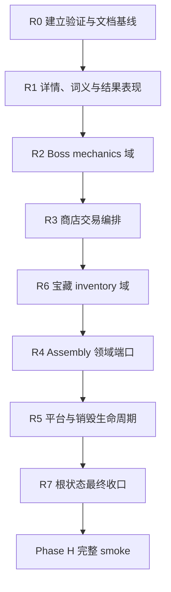

# GamePanel 架构拆分计划（v4）

> 状态：**R7 已完成**（2026-06-25）；**下一项 Phase H smoke** / v4 终态验收
>
> 制定日期：2026-06-25
>
> 当前基线：`src/components/GamePanel.vue` **4,407 行**（R0 实测；计划起草时 4,471）
>
> 前置计划：
>
> - `design/gamepanel-architecture-plan-v3.md`
> - `design/gamepanel-architecture-plan-v3-supplement.md`
>
> 当前前置状态：v3 与 v3-supplement 的编码工作已经完成；完整 Phase H smoke 尚未执行。

---

## 0. 计划目的

v3 与 v3-supplement 已经把 `GamePanel.vue` 从约 16,962 行降低到当前 4,471 行，并完成了组件宿主、controller、动画模块、bootstrap、assembly 和 playfield 等多轮拆分。

当前 `GamePanel.vue` 的模板只有约 28 行，剩余约 4,440 行几乎全部是脚本。它已经不再是最初意义上的巨型 UI 组件，但仍同时承担：

1. 根 session 与 controller 装配。
2. Boss 规则和提示状态。
3. 商店购买、出售与奖励分派。
4. tile 详情、长按、预览导航和词义层状态。
5. 计分结果区的 presentation 状态。
6. 宝藏库存与槽位操作 glue。
7. assembly 的大规模依赖映射。
8. Android 返回键、平台事件和销毁清理。

v4 的目标不是单纯追求 SFC 行数，而是继续把这些较重职责拆成可以独立理解、测试和维护的业务域。

---

## 1. 核心结论

### 1.1 不直接执行旧 S7 方案

v3-supplement 的可选 S7 建议：

```text
useGamePanelRoot.js   // 托管全部根逻辑
GamePanel.vue         // template + 一次 composable 调用
```

v4 不把该方案作为默认路线。

如果把当前约 4,400 行脚本整体迁入一个 `useGamePanelRoot.js`，虽然 `GamePanel.vue` 可以降到 100 行以内，但：

- 总体复杂度没有下降。
- 仍会形成一个新的巨型文件。
- 业务域边界不会更清晰。
- 后续修改仍需要读取和理解几千行根文件。
- 测试入口不会自然改善。

只有完成 v4 的垂直领域拆分后，若剩余根装配仍有必要单独托管，才重新评估是否建立一个较小的 root composable。

### 1.2 目标终态

`GamePanel.vue` 最终只负责：

- props 与 emits。
- 创建根 session、phase 和基础 store。
- 按依赖顺序实例化 controller。
- mount/provide session namespaces。
- 连接少量不可避免的跨域端口。
- mounted/unmounted 总入口。
- 根模板与宿主组件。

建议目标：

| 指标 | 目标 |
|---|---:|
| `GamePanel.vue` | **1,200～2,000 行** |
| 新增普通 controller | 尽量 **≤800 行** |
| 新增纯逻辑/端口模块 | 尽量 **≤300 行** |
| 单个新业务函数 | 原则上 **≤80 行** |
| `GamePanel.vue` 新业务逻辑 | 原则上 **0 行** |

1,200～2,000 行是结构目标，不是硬性验收门槛。若继续降低行数需要制造无意义的转发层，应保留更清楚的实现。

---

## 2. 当前基线

### 2.1 文件构成

当前 `src/components/GamePanel.vue`：

| 区域 | 行数 |
|---|---:|
| template | 1～28 |
| `<script setup>` | 30～4,471 |
| style | 无 |
| 总行数 | **4,471** |

### 2.2 已有可复用边界

当前已经存在：

- `src/components/run/**` 宿主组件。
- `src/runSession/controllers/**` 领域 controller。
- `src/runSession/useGamePanelSessionAssembly.js`。
- `src/runSession/buildGamePanelAssemblyDeps.js`。
- `src/runSession/buildGamePanelAssemblySource.js`。
- `src/runSession/buildGamePanelBootstrapDeps.js`。
- `src/runSession/gamePanelBootstrapRunners.js`。
- `src/game/**` 中的纯逻辑和动画模块。

v4 必须优先复用这些边界，不回退为 `GamePanel.vue` 内联实现，也不在新模块中复制已有实现。

### 2.3 文档基线差异

当前文档中的部分行数已经过期：

- v3-supplement 文首记录为 4,526 行。
- `.cursor/rules/game-panel-boundary.mdc` 仍记录约 8,495 行。
- 当前工作区实测为 **4,407 行**（R0 2026-06-25）。
- `.cursor/rules/game-panel-boundary.mdc` 已更新为 **4,407** 行（R0）。

---

## 3. 实施原则

### 3.1 垂直切片

每次只迁移一个完整职责域：

```text
状态
→ 纯逻辑
→ 副作用编排
→ controller API
→ 消费者接线
→ 删除 GamePanel 旧实现
```

禁止只建立新文件但长期保留旧实现，也禁止新旧路径双写。

### 3.2 按业务归属拆分

| 内容 | 默认归属 |
|---|---|
| 根装配、provide、生命周期总入口 | `GamePanel.vue` |
| 领域流程与有状态编排 | `src/runSession/controllers/*.js` |
| 纯规则、计算、分派 | `src/game/*.js`、`src/shop/*.js` |
| UI 宿主和局部交互 | `src/components/run/*.vue` |
| 跨 controller 的窄接口 | `src/runSession/ports/*.js` |

### 3.3 不制造新的巨石

- 不把大块逻辑直接并入已有 800～1,400 行 controller。
- `useShopPhaseController.js` 不直接吸收全部交易逻辑。
- `useTreasureRunController.js` 不直接吸收全部 inventory 与 UI glue。
- `usePlayfieldController.js` 不继续吸收所有详情和结果区 presentation。
- 新文件接近 800～1,000 行时，必须重新检查是否混合了两个以上职责。

### 3.4 不为减少行数硬拆

以下情况不单独建文件：

- 只有一两个无状态转发函数。
- 仅把对象字面量原样搬到另一个文件。
- 新模块需要注入数百个散乱字段，却没有形成稳定领域 API。
- 拆分后出现明显循环依赖。

---

## 4. 总体执行顺序



推荐顺序说明：

1. R1 边界最清楚，副作用相对较少，适合作为第一轮。
2. R2 先收口 Boss 规则，避免后续交易和 assembly 继续依赖散落的 Boss 分支。
3. R3 先建立交易 controller API。
4. R6 再为交易 controller 提供稳定 inventory API。
5. R4 在领域 API 稳定后重构 assembly 依赖，避免先整理一次、后续又反复改动。
6. R5、R7 最后处理根生命周期和剩余状态。

---

## 5. Phase R0 — 建立可靠基线

### 5.1 目的

当前 v3-supplement 编码完成，但完整 Phase H smoke 尚未执行。继续重构前必须先确认当前工作区不是明显损坏状态。

R0 不要求先完成全部 Phase H，但必须建立最小可靠基线。

### 5.2 执行项

- [x] 记录当前 `GamePanel.vue` 行数：**4,407**（2026-06-25 实测；计划起草时 4,471）。
- [x] 执行 `npm test`：**167/167** 通过。
- [x] 执行 `npm run build`：通过（Vite 6.4.1，~41.6s）。
- [ ] 执行核心 smoke 子集（**待用户手测**；自动化仅验证主菜单可加载）：
  - [ ] 新局进入与 grid intro。
  - [ ] 选字、提交和弃牌。
  - [ ] 商店购买一个普通宝藏。
  - [ ] 使用一次法术或完成一次卡包选择。
  - [ ] 完成一次小关结算。
  - [ ] 打开暂停层并测试 Android/浏览器返回路径。
- [x] 记录已知环境限制和未覆盖项（见 §5.4）。
- [x] 更新 `.cursor/rules/game-panel-boundary.mdc` 的当前行数 → **4,407**。
- [x] 更新 v3-supplement 文首：历史完成点 4,526；v4 起点 **4,407**。
- [x] 建立 R0 恢复点：`word_master_bak/v4-r0-baseline-2026-06-25/`。

### 5.4 R0 验证记录（2026-06-25）

| 项 | 结果 |
|---|---|
| `GamePanel.vue` 行数 | **4,407** |
| `npm test` | **167/167** |
| `npm run build` | ✅ |
| `find-dead-imports` | **0** |
| 浏览器加载 | 主菜单正常（`http://localhost:5173/`） |
| 核心 smoke 子集 | **未跑完** — Cursor 浏览器自动化无法可靠驱动棋盘/WebGL 交互；完整子集需用户在 Vite dev 下手测（清单见 `design/gamepanel-split-smoke.md` §1～§8 子集） |
| Android 返回键 | 未覆盖（需真机或 Capacitor） |
| 存档续玩 smoke | 未覆盖 |

**R0 结论**：自动化基线（test/build/dead-import/行数/文档）稳定，**不阻断进入 R1**；核心 smoke 子集仍待用户手测，与 v3-supplement「待 Phase H 手测」一致。

### 5.5 R0 备份

| Phase | 备份路径 | GamePanel 行数 | 日期 |
|---|---|---:|---|
| **R0 起点/恢复点** | `word_master_bak/v4-r0-baseline-2026-06-25/` | 4,407 | 2026-06-25 |
| **R1.3 前置** | `word_master_bak/v4-r1.3-pre-2026-06-25/` | 4,038 | 2026-06-25 |
| **R1.3 完成** | `word_master_bak/v4-r1.3-2026-06-25/` | 3,865 | 2026-06-25 |
| **R2 前置** | `word_master_bak/v4-r2-pre-2026-06-25/` | 3,865 | 2026-06-25 |
| **R2 完成** | `word_master_bak/v4-r2-2026-06-25/` | 3,785 | 2026-06-25 |
| **R3 前置** | `word_master_bak/v4-r3-pre-2026-06-25/` | 3,480 | 2026-06-25 |
| **R3 完成** | `word_master_bak/v4-r3-2026-06-25/` | 3,256 | 2026-06-25 |
| **R6 前置** | `word_master_bak/v4-r6-pre-2026-06-25/` | 3,256 | 2026-06-25 |
| **R6 完成** | `word_master_bak/v4-r6-2026-06-25/` | 3,184 | 2026-06-25 |
| **R4 完成** | `word_master_bak/v4-r4-complete-2026-06-25/` | 3,462 | 2026-06-25 |
| **R5 前置** | `word_master_bak/v4-r5-pre-2026-06-25/` | 3,462 | 2026-06-25 |
| **R5 完成** | `word_master_bak/v4-r5-complete-2026-06-25/` | 3,450 | 2026-06-25 |
| **R7 前置** | `word_master_bak/v4-r7-pre-2026-06-25/` | 3,450 | 2026-06-25 |
| **R7 完成** | `word_master_bak/v4-r7-complete-2026-06-25/` | 3,400 | 2026-06-25 |

### 5.3 阻断条件

若核心 smoke 出现回归：

1. 先确认问题是否已经存在于 v4 开始前。
2. 优先修复基线问题。
3. 在基线稳定前不进入 R1。

---

## 6. Phase R1 — 详情、词义与结果表现域

### 6.1 当前问题

`GamePanel.vue` 仍维护：

- 词义层开关与预览内容。
- tile 长按和主点击仲裁。
- tile 详情 payload 构建。
- deck card、grid tile、word slot 的详情适配。
- 详情预览导航。
- 结果区分数、倍率和字长的 display computed。
- 多组升级/降级结果 FX model。

这些逻辑属于 playfield presentation，但并不应该继续由根组件维护。

### 6.2 目标模块

```text
src/runSession/controllers/useTileDetailController.js
src/runSession/controllers/useWordDefinitionController.js
src/runSession/controllers/useRunResultPresentation.js
```

可选纯逻辑模块：

```text
src/game/tileDetailPayload.js
src/game/runResultPresentation.js
```

### 6.3 迁移范围

#### R1.1 `useWordDefinitionController` ✅（2026-06-25）

- [x] `wordDefinitionLayerOpen`
- [x] `wordDefinitionHiddenForWordLeave`
- [x] display mode 与 zone visibility
- [x] trigger mode
- [x] preview bundle、word、lines
- [x] open/close
- [x] visible watch

完成后：

- [x] `InRunPlayfield.vue` 从 `session.ui.wordDefinition` 读取状态。
- [x] 删除 `GamePanel.vue` 模板中剩余的 word-definition props。

**落地**：`src/runSession/controllers/useWordDefinitionController.js`；`GamePanel.vue` **4,222 行**（−185）；`npm test` 167/167；`npm run build` ✅。

#### R1.2 `useTileDetailController` ✅（2026-06-25）

- [x] tile 长按 timer 与 cleanup
- [x] touch pointer 判断
- [x] 主点击仲裁
- [x] context menu（经 playfield → detail API）
- [x] `openTileDetail` / `closeTileDetail` / dismiss 动画
- [x] tile/deck card/word slot payload 构建（`tileDetailPayload.js`）
- [x] preview nav

**落地**：`useTileDetailController.js` + `tileDetailPayload.js`；`usePlayfieldController` 删除重复长按/点按逻辑，改走 detail API；`session.ui.tileDetail` 挂载；`GamePanel.vue` **4,038 行**（−184）；`npm test` 167/167；`npm run build` ✅。

#### R1.3 `useRunResultPresentation` ✅（2026-06-25）

- [x] result total 与 formula display
- [x] score/mult display computed
- [x] word length display
- [x] clear-win、boss downgrade、rarity upgrade、in-run upgrade 的 presentation model
- [x] result area DOM getter

**落地**：`useRunResultPresentation.js` + `runResultPresentation.js`；`session.ui.runResultPresentation` 挂载；`GamePanel.vue` **3,865 行**（−173）；`npm test` 173/173；`npm run build` ✅。

### 6.4 预计收益

| 项目 | 预计减少 |
|---|---:|
| 词义层 | 70～110 行 |
| tile 详情与交互 | 220～320 行 |
| 结果表现 | 160～220 行 |
| 合计 | **450～650 行** |

### 6.5 验证

- [ ] tile 点击打开详情。
- [ ] 长按打开详情。
- [ ] 拖动或取消 pointer 不误触详情。
- [ ] grid、deck、word slot 详情 payload 正确。
- [ ] 详情前后导航正常。
- [ ] 词义入口、展开和关闭正常。
- [ ] 首词教程期间词义入口 gate 正常。
- [ ] 提交计分显示、字长和倍率显示正常。
- [ ] `npm test`。
- [ ] `npm run build`。

---

## 7. Phase R2 — Boss mechanics 域 ✅（2026-06-25）

### 7.1 当前问题

Boss 相关状态与规则仍散布在根组件中：

- boss slug 与 treasure suppression。
- tape cue timer 和视觉状态。
- crimson/verdant/ox 等 Boss 分支。
- tile debuff context。
- submit 前后 Boss hook。
- soft word violation preview。

这些规则与根装配无关，应形成稳定的 Boss mechanics API。

### 7.2 目标模块

```text
src/runSession/controllers/useBossMechanicsController.js
src/game/bossMechanicsContext.js
```

已有模块继续复用：

```text
src/game/bossTileDebuff.js
src/game/bossWordViolation.js
src/game/bossRestrictionCue.js
src/game/treasureBossSuppress.js
```

### 7.3 对外 API 建议

```js
{
  slug,
  suppressed,
  flags,
  tape,
  preview,
  buildTileDebuffContext,
  refreshTileDebuff,
  beforeSubmit,
  afterSubmit,
  onTreasureSold,
  dispose,
}
```

`GamePanel.vue` 和其他 controller 不再直接新增 `bossSlug === "..."` 分支。

### 7.4 预计收益

预计从 `GamePanel.vue` 减少 **250～350 行**。

### 7.5 验证

- [x] `npm test`：**177/177**
- [x] `npm run build`：✅
- [ ] Boss tape 文案与动效（手测）
- [ ] crimson 禁用槽位（手测）
- [ ] verdant 出售后的 debuff 清理（手测）
- [ ] ox 命中判断（手测）
- [ ] wildcard/Boss 词规则预览（手测）
- [ ] Boss restriction cue（手测）
- [ ] Boss reroll 后 controller 状态刷新（手测）

**落地（2026-06-25）**：`useBossMechanicsController.js` + `bossMechanicsContext.js`；`useRunLifecycleController` 改经 `bossApi` 注入；`playBossTapeTriggerCue` 优先转发 `BossTapeStrip.playTriggerCue`；`session.ui.bossMechanics` 挂载；`GamePanel.vue` **3,785 行**（−80）；`npm test` 177/177；`npm run build` ✅。

---

## 8. Phase R3 — 商店交易编排 ✅（2026-06-25）

### 8.1 当前问题

当前 `onTreasurePurchase()` 约 187 行，并在单函数中分派：

- bundle pack
- voucher
- deck tile / deck letter
- spell
- upgrade
- 普通宝藏

同时混合：

- 价格校验。
- 钱包扣款。
- 统计记录。
- 货架清理。
- 详情层关闭。
- 飞行动画。
- inventory 写入。
- autosave。

`onTreasureSell()` 与随机授予宝藏也仍在根组件中。

### 8.2 目标模块

```text
src/runSession/controllers/useShopTransactionController.js
src/shop/shopPurchaseDispatch.js
```

已有 `useShopPhaseController.js` 继续只负责商店阶段、库存生成、reroll 和 visit 生命周期。

### 8.3 分派结构

使用 handler 表或明确的 dispatcher：

```text
bundlePack → purchaseBundlePack
voucher    → purchaseVoucher
deckTile   → purchaseDeckTile
deckLetter → purchaseDeckTile
spell      → purchaseSpell
upgrade    → purchaseUpgrade
treasure   → purchaseTreasure
```

`shopPurchaseDispatch.js` 负责识别 offer 类型和选择 handler；controller 负责副作用编排。

### 8.4 事务边界

每种购买 handler 必须明确：

1. 校验。
2. 关闭或隐藏详情层。
3. 扣款与统计。
4. 清理 offer。
5. 发放内容。
6. 播放动画。
7. autosave。

禁止不同 handler 随意改变步骤顺序。若某类商品顺序特殊，必须在代码注释和测试中说明。

### 8.5 预计收益

预计从 `GamePanel.vue` 减少 **260～320 行**。

### 8.6 验证

- [ ] 普通宝藏购买（手测）
- [ ] voucher 购买及货架槽位变化（手测）
- [ ] spell 购买，包括需要目标选择的法术（手测）
- [ ] upgrade 购买与播放（手测）
- [ ] deck tile / letter 购买（手测）
- [ ] bundle pack 购买与开包（手测）
- [ ] 钱包 floor 限制（手测）
- [ ] 宝藏槽位已满（手测）
- [ ] 出售普通宝藏（手测）
- [ ] no-sell accessory 限制（手测）
- [ ] 每条路径都触发 autosave（手测）
- [x] `npm test`：**179/179**
- [x] `npm run build`：✅

**落地（2026-06-25）**：`useShopTransactionController.js` + `shopPurchaseDispatch.js`；`session.ui` 挂载 `shopTransactionCtrl`；spell/pack 回调经 `bindPostAssemblyCallbacks` 回填；顺带修复 spell grant 购买路径未接线 `spellCastController` 的问题；`GamePanel.vue` **3,256 行**（−224，相对 R3 前置 3,480）；`npm test` 179/179；`npm run build` ✅。

---

## 9. Phase R6 — 宝藏 Inventory 域 ✅（2026-06-25）

> 编号沿用总体顺序中的 R6，用于强调它与 R3 的依赖关系。

### 9.1 当前问题

当前宝藏相关职责横跨：

- `useTreasureRunController`
- `GamePanel.vue`
- shop purchase flow
- treasure bar presentation

需要明确区分：

| Controller | 职责 |
|---|---|
| `useTreasureRunController` | 宝藏运行时 hooks、规则和 run state |
| `useTreasureInventoryController` | 槽位、授予、移除、压缩、出售、详情入口和 bar presentation |

### 9.2 目标模块

```text
src/runSession/controllers/useTreasureInventoryController.js
```

必要时拆出纯逻辑：

```text
src/game/treasureInventoryMutation.js
```

### 9.3 迁移内容

- filled/hidden count。
- treasure bar stack/layout 状态。
- empty slot click。
- compact animation 协调。
- slot DOM 查找。
- grant random treasure。
- grant copy。
- clear/remove slot。
- sell 后 compact。
- 详情打开入口。
- `shopTransaction` 所需 inventory API。

### 9.4 对外 API 建议

```js
{
  ownedTreasures,
  presentation,
  findPlacementIndex,
  grantAt,
  grantRandom,
  grantRandomCopy,
  removeAt,
  sellAt,
  openDetail,
  getSlotElement,
  waitForSlotElement,
}
```

### 9.5 预计收益

预计从 `GamePanel.vue` 减少 **250～400 行**。

### 9.6 验证

- [ ] 普通授予（手测）
- [ ] 指定槽位授予（手测）
- [ ] 随机复制（手测）
- [ ] crop 扩槽（手测）
- [ ] 出售后槽位压缩（手测）
- [ ] accessory 对槽位数量的影响（手测）
- [ ] treasure bar stack/expand（手测）
- [ ] 宝藏详情打开和导航（手测）
- [ ] R3 全部交易 smoke 回归（手测）
- [x] `npm test`：**181/181**
- [x] `npm run build`：✅

**落地（2026-06-25）**：`useTreasureInventoryController.js` + `treasureInventoryMutation.js`；随机授予/复制从 `useShopTransactionController` 迁入 inventory；`shopTransaction` 改经 `inventory` API；`session.ui` 挂载 `treasureInventoryCtrl`；`GamePanel.vue` **3,184 行**（−72，相对 R6 前置 3,256）；`npm test` 181/181；`npm run build` ✅。

---

## 10. Phase R4 — Assembly 领域端口

### 10.1 当前问题

当前 `gamePanelAssemblySource()` 约 373 行，仍是一份巨型依赖映射。

它虽然已经把 assembly 实现实质迁出 `GamePanel.vue`，但根组件仍必须知道大量 controller 内部字段和函数。

如果只是把该对象原样搬入另一个文件，只会形成新的依赖字典，不算完成 R4。

### 10.2 目标结构

```text
src/runSession/ports/createRunPorts.js
src/runSession/ports/createPlayfieldPorts.js
src/runSession/ports/createTreasurePorts.js
src/runSession/ports/createShopPorts.js
src/runSession/ports/createUiFxPorts.js
src/runSession/createGamePanelPorts.js
```

示意：

```js
const ports = createGamePanelPorts({
  run: createRunPorts(...),
  playfield: createPlayfieldPorts(...),
  treasures: createTreasurePorts(...),
  shop: createShopPorts(...),
  uiFx: createUiFxPorts(...),
});

const panelAssembly = useGamePanelSessionAssembly({ ports });
```

### 10.3 端口规则

- 每个 port 只暴露一个领域的稳定能力。
- 不允许 port 反向 import controller。
- controller 实例由根层创建，再注入 port factory。
- 避免 getter 套 getter；稳定 ref 可以直接传 ref。
- 不暴露 controller 不需要的整个 store。
- 不在 port 中实现业务流程。

### 10.4 Assembly 同步调整

`useGamePanelSessionAssembly.js` 应逐步从：

```text
deps.xxx
deps.yyy
deps.zzz
```

改为：

```text
ports.run.xxx
ports.playfield.xxx
ports.treasures.xxx
ports.shop.xxx
ports.uiFx.xxx
```

本阶段允许拆成多个子任务，每次只迁移一个领域。

**落地（R4.1 shop，2026-06-25）**：

- 新增 `src/runSession/ports/createShopPorts.js`、`createGamePanelPorts.js`、`createGamePanelAssemblyGroups.js`
- `buildGamePanelAssemblySource` 不再平铺 shop 域；`buildGamePanelAssemblyDeps` 移除 52 个 shop 键
- `useGamePanelSessionAssembly` 改经 `ports.shop` 注入商店/PackPick 能力
- `GamePanel.vue` **3,466 行**（assembly 分域结构外提；binding 仍留根层 shorthand 对象）
- `npm test` 181/181；`npm run build` ✅；`find-dead-imports` 0

**落地（R4.2 playfield，2026-06-25）**：

- 新增 `src/runSession/ports/createPlayfieldPorts.js`（61 键，对应 assembly `grid` 分域）
- `createGamePanelPorts` 挂载 `ports.playfield`；`buildGamePanelAssemblySource` / `buildGamePanelAssemblyDeps` 移除 grid 平铺
- `useGamePanelSessionAssembly` 改经 `ports.playfield` 注入棋盘/字母库/选词能力
- `GamePanel.vue` **3,466 行**（不变）；`npm test` 181/181；`npm run build` ✅

**落地（R4.3 treasures，2026-06-25）**：

- 新增 `src/runSession/ports/createTreasurePorts.js`（55 键，含 `wordSlotPresentation` → assembly 内 `injectedWordSlotPresentation`）
- `createGamePanelPorts` 挂载 `ports.treasures`；deps 移除 treasure 平铺 **55** 键
- `useGamePanelSessionAssembly` 改经 `ports.treasures` 注入宝藏 inventory / 栏位 / 拖拽能力
- `npm test` 181/181；`npm run build` ✅；`find-dead-imports` 0

**落地（R4.4 run，2026-06-25）**：

- 新增 `src/runSession/ports/createRunPorts.js`（72 键：关卡/Boss/成就补记/run lifecycle）
- `createGamePanelPorts` 挂载 `ports.run`；deps 移除 run 平铺 **72** 键
- `useGamePanelSessionAssembly` 改经 `ports.run` 注入
- `npm test` 181/181；`npm run build` ✅

**落地（R4.5 收尾，2026-06-25）**：

- 新增 `createCorePorts.js`、`createOverlayPorts.js`、`createScoringPorts.js`、`createUiFxPorts.js`（11 + 45 + 51 + 14 键）
- `buildGamePanelAssemblySource` / `buildGamePanelAssemblyDeps` 降为**空壳**；assembly 仅经 `ports.*` + `openStageSettlement` 注入
- `GamePanel.vue` 接线简化为 `createGamePanelPorts(groups)` + `openStageSettlement` 前向引用（**3,462 行**）
- `bumpOverlayZ` 改从 `overlayStackController.bumpOverlayZ` 解析（修复原先 deps 漏接）
- `npm test` 181/181；`npm run build` ✅

**R4 汇总**：8 域 port（core / playfield / shop / treasures / run / overlay / scoring / uiFx）；deps 平铺字典 **361 键全部迁出**。

### 10.5 预计收益

预计从 `GamePanel.vue` 减少 **450～700 行**，并显著减少 import 和 assembly 接线噪声。

### 10.6 验证

- [x] R4.1：仅切换 shop port 域
- [x] R4.2：仅切换 playfield port 域
- [x] R4.3：仅切换 treasures port 域
- [x] R4.4：仅切换 run port 域
- [x] R4.5：core / overlay / scoring / uiFx 收尾
- [ ] 每次切换后运行相关 smoke
- [x] R4.1：删除 shop 旧字段映射（deps 52 键）
- [x] R4.2：删除 playfield 旧字段映射（deps 61 键）
- [x] R4.3：删除 treasures 旧字段映射（deps 55 键）
- [x] R4.4：删除 run 旧字段映射（deps 72 键）
- [x] R4.5：删除 core/overlay/scoring/fx 旧字段映射（121 键）；deps 字典空壳化
- [x] R4.1：不保留兼容 fallback
- [x] R4.1：assembly 无循环依赖（port factory 仅包装 groups）
- [x] `npm test`
- [x] `npm run build`

---

## 11. Phase R5 — 平台与销毁生命周期

### 11.1 当前问题

根组件仍直接负责：

- Android back 优先级。
- overlay dismiss 路由。
- resize 与 visualViewport listener。
- platform hook 注册。
- autosave flush/cancel。
- controller dispose。
- timer、RAF 和 GSAP 清理。

这些内容可以保留一个根入口，但不需要在 `GamePanel.vue` 展开全部细节。

### 11.2 目标模块

```text
src/runSession/controllers/useGamePanelPlatformController.js
src/runSession/createGamePanelDisposer.js
```

### 11.3 设计要求

`useGamePanelPlatformController`：

- 注册和注销 Android back。
- 注册和注销 viewport resize。
- 根据 overlay 状态调用注入的 dismiss handler。
- 不直接读取未注入的全局 controller。

`createGamePanelDisposer`：

- 接收 dispose 函数列表。
- 统一处理 timer、GSAP、RAF、autosave 和 controller cleanup。
- dispose 应尽量幂等。

各 controller 应优先自行暴露 `dispose()`，不要把其内部 timer 的清理细节继续泄漏到根层。

### 11.4 预计收益

预计从 `GamePanel.vue` 减少 **140～220 行**。

### 11.5 验证

**落地（R5，2026-06-25）**：

- 新增 `src/runSession/controllers/useGamePanelPlatformController.js`（Android back + viewport resize 注册/注销）
- 新增 `src/runSession/createGamePanelDisposer.js`（幂等 dispose 列表）
- 新增 `src/runSession/buildGamePanelAndroidBackHandler.js`（宝藏详情 dismiss + `handleGameAndroidBack` 包装）
- `GamePanel.vue`：`platformCtrl.register()` 经 `useRunPanelBootstrap`；`onUnmounted` → `panelBootstrap.dispose()` → `disposeGamePanel`
- 修复误删：`enterEndlessModeAfterWin`、`treasureGemClass`、选词槽 watch、无尽模式 watch
- 移除未定义 `tutorialSpotlightRaf` 引用，改 `disposeFirstWordTutorial()`
- `GamePanel.vue` **3,450 行**（-12）；`npm test` 181/181；`npm run build` ✅；`find-dead-imports` 0

- [ ] 各 overlay 返回键优先级（Phase H smoke 待验）
- [ ] 商店和 playfield 返回路径（Phase H smoke 待验）
- [ ] 暂停层返回（Phase H smoke 待验）
- [ ] settlement intro 返回（Phase H smoke 待验）
- [ ] resize 后 word slot 布局刷新（Phase H smoke 待验）
- [ ] 离开 GamePanel 后无残留 timer/RAF（Phase H smoke 待验）
- [ ] autosave 正常 flush（Phase H smoke 待验）
- [ ] 重复 mount/unmount 无报错（Phase H smoke 待验）
- [x] `npm test`。
- [x] `npm run build`。

---

## 12. Phase R7 — 根状态最终收口

### 12.1 触发条件

仅在 R1～R6 完成后执行。

此时重新审计 `GamePanel.vue` 剩余状态，判断是否还有天然成组、可以独立命名的 presentation state。

### 12.2 候选模块

```text
src/runSession/controllers/useRunHeaderPresentation.js
src/runSession/controllers/useGamePanelOverlayState.js
src/runSession/controllers/useRunScoringPresentation.js
```

是否建立这些模块，以实际剩余内容为准，不要求全部创建。

### 12.3 保留在根层的内容

以下内容可以继续保留在 `GamePanel.vue`：

- props / emits。
- 根 session 创建。
- controller 的有序实例化。
- 少量跨 controller lazy bridge。
- provide/mount。
- 根宿主 ref。
- mounted/unmounted 总调用。

### 12.4 是否建立 `useGamePanelRoot`

R7 完成后仅在以下条件同时满足时考虑：

1. `GamePanel.vue` 剩余脚本几乎全部是装配代码。
2. root composable 预计不超过约 800～1,200 行。
3. 搬迁后不会隐藏 controller 的创建顺序。
4. 不需要重新引入巨型 deps 字典。
5. 能明显改善测试或复用，而不只是改变文件扩展名。

否则不创建 `useGamePanelRoot.js`。

### 12.5 预计收益

预计从 `GamePanel.vue` 减少 **200～400 行**。

**落地（R7，2026-06-25）**：

- 新增 `useRunHeaderPresentation.js`（关卡标题、奖励 $、钱包展示、分数框覆盖、顶栏 GSAP dispose）
- 新增 `useGamePanelRunFlowOverlayState.js`（结算/整局结束层、portal z-index 栈）
- 新增 `useGamePanelInfoModal.js`（信息弹层 tab 状态）
- 新增 `useRunSubmitCountPresentation.js`（提交 `-1` 计数动效）
- 新增 `buildGamePanelAssemblyBinding.js`：assembly 键按 8 域分块合并（替代平铺 `gamePanelAssemblyBinding()`）
- 修复 `openStageSettlement` assembly 注入：改用 `openStageSettlementSlot` 前向引用（避免 TDZ）
- 移除 GP 内重复的 `levelAdvanceFxTl` dispose（生命周期已在 `useRunLifecycleController`）
- **未**建立 `useGamePanelRoot.js`（剩余脚本仍含大量 controller 装配，不满足 §12.4）
- `GamePanel.vue` **3,400 行**（R5 后 3,450，-50）；`npm test` 181/181；`npm run build` ✅

### 12.6 验证

- [x] `npm test`
- [x] `npm run build`
- [x] `find-dead-imports` 0
- [ ] Phase H smoke（待验）

---

## 13. 行数预期

| 阶段 | 预计减少 | 预计剩余 |
|---|---:|---:|
| 当前基线 | — | 4,471 |
| R1 | 450～650 | 3,821～4,021 |
| R2 | 250～350 | 3,471～3,771 |
| R3 | 260～320 | 3,151～3,511 |
| R6 | 250～400 | 2,751～3,261 |
| R4 | 450～700 | 2,051～2,811 |
| R5 | 140～220 | 1,831～2,671 |
| R7 | 200～400 | **1,431～2,471** |

考虑迁移后必要的新接线、注释和类型说明，最终现实目标仍定为：

```text
GamePanel.vue：约 1,500～2,000 行
```

如果在约 2,200 行时已经只剩清晰根装配，不为了数字继续拆分。

---

## 14. 每个切片的标准闭环

每个子任务必须按以下顺序完成：

1. 审计当前调用方和状态所有者。
2. 定义新 controller 或纯逻辑模块的职责。
3. 先为纯逻辑补测试。
4. 建立新实现。
5. 只切换一个真实消费者。
6. 验证新路径。
7. 删除 `GamePanel.vue` 旧实现。
8. 清理 dead import。
9. 执行债务 grep。
10. 执行 `npm test`。
11. 执行 `npm run build`。
12. 执行对应 smoke 子集。
13. 记录行数和恢复点。

禁止：

- 长期双写。
- 通过 fallback 保留第二套实现。
- 使用按行号重建或批量拼接 `GamePanel.vue` 的脚本。
- 使用未经确认的临时文件覆盖正式源码。

---

## 15. 测试策略

### 15.1 单元测试优先对象

优先为以下纯逻辑补测试：

- tile detail payload 构建。
- Boss mechanics context。
- shop offer 类型分派。
- inventory mutation。
- port 对象字段契约。

### 15.2 Controller 测试

controller 测试重点：

- 状态变更。
- handler 调用顺序。
- 异常或提前返回时不产生部分副作用。
- dispose 幂等。

### 15.3 Smoke 分配

| Phase | 重点 smoke |
|---|---|
| R1 | 选字、详情、词义、计分结果 |
| R2 | Boss 规则、tape、debuff、reroll |
| R3 | 商店各种商品购买与出售 |
| R6 | 宝藏授予、槽位、压缩、详情 |
| R4 | playfield、submit、spell、shop、settlement 全域子集 |
| R5 | 返回键、暂停、resize、退出 |
| R7 | 完整 Phase H |

---

## 16. 债务 grep

每阶段完成后按对应职责检查 `GamePanel.vue`。

### R1 后

```text
tileLongPressTimer
tilePrimaryTapPending
buildTileDetailPayloadFromTile
buildTileDetailPayloadFromDeckCard
wordDefinitionPreviewBundle
clearWinFxModel
armBossDowngradeFxModel
```

### R2 后

```text
isManacleBossGrid
isAmberBossMaskActive
isCrimsonBossMechanicsActive
pickCrimsonDisabledTreasureSlotIndex
evaluateOxBossHit
bossTapeWobbleClearTimer
```

### R3 后

```text
async function onTreasurePurchase
async function onTreasureSell
grantRandomShopTreasureByRarity
offerType === "voucher"
offerType === "upgrade"
offerType === "bundlePack"
```

### R6 后

```text
ownedTreasureFilledCount
treasureBarStackMode
clearOwnedTreasureSlotAtIndex
grantCopyOfRandomOwnedTreasure
openGameTreasureDetail
```

### R4 后

```text
function gamePanelAssemblySource
```

允许保留一个很薄的 `createGamePanelPorts(...)` 调用，不允许保留数百行字段字典。

### R5 后

```text
ANDROID_BACK_GAME_PRIORITY
registerGamePanelPlatformHooks
window.addEventListener("resize"
window.visualViewport
gsap.killTweensOf
```

---

## 17. 文档同步

| 文件 | 更新时机 |
|---|---|
| `design/gamepanel-architecture-plan-v4.md` | 每个子任务完成后更新状态、行数和决定 |
| `design/gamepanel-controller-wiring-matrix.md` | 新增 controller、namespace 或 port 时更新 |
| `design/gamepanel-split-smoke.md` | 新增必要 smoke 或记录验证结果 |
| `.cursor/rules/game-panel-boundary.mdc` | R0 更新基线；v4 完成后更新终态边界 |
| v3 / v3-supplement | 只补充“已由 v4 承接”，不重写历史记录 |

---

## 18. 完成标准

v4 完成必须满足：

- [ ] `GamePanel.vue` 不再包含成块的详情交互实现。
- [ ] `GamePanel.vue` 不再包含成块的 Boss 规则实现。
- [ ] `GamePanel.vue` 不再包含商店商品类型购买分派。
- [ ] `GamePanel.vue` 不再直接维护宝藏 inventory 变更流程。
- [x] assembly 通过领域 ports 接线，不再维护数百行平铺 source。
- [x] 平台注册和 dispose 细节已收口。
- [ ] 没有产生新的 2,000～4,000 行巨型 root 文件。
- [ ] `npm test` 全部通过。
- [ ] `npm run build` 通过。
- [ ] Phase H smoke 全表完成，或逐项记录明确的环境阻断。
- [ ] dead import 检查为 0。
- [ ] wiring matrix 与 boundary 文档同步。
- [ ] 建立 v4 最终恢复点。

最终评判标准不是“GamePanel 是否足够短”，而是：

> 后续修改某个业务域时，是否通常只需要阅读和修改一个 controller、一个纯逻辑模块以及一个明确消费者，而不必重新理解整份 `GamePanel.vue`。

