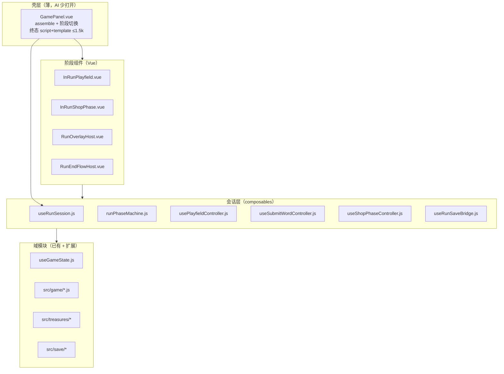

# GamePanel 架构拆分计划（v2）

> **状态**：设计稿，尚未实施。  
> **取代**：2026-06 的 `gamepanel-refactor-tasks.md`（17 任务 + 批量 patch 脚本方案，已废弃）。  
> **边界规则**：实施期遵循 `.cursor/rules/game-panel-boundary.mdc`（与本计划同步维护）。  
> **用途**：每个 **任务编号** 单独开一个 AI 对话执行；完成后再开下一项。

---

## 0. 主旨与首要目标（读计划前先读本节）

### 0.1 为什么要拆

**首要痛点**：`GamePanel.vue` 约 **1.6 万行**。只要改动涉及它，AI 往往需要读/搜/改整个巨型文件，**响应极慢**。  
拆分的第一优先级是 **让 AI 按需读小文件、改得更快**；在此前提下，**低耦合、边界清晰、结构优雅** 同样值得做，且往往与小文件目标一致。

### 0.2 成功标准（按优先级）

1. **AI 按需读小文件**：改商店 → 主要打开 `useShopPhaseController.js` + `InRunShopPhase.vue`，而不是 16k 的 `GamePanel.vue`。
2. **单文件体积持续下降**：每完成一个 Phase，`GamePanel.vue` 对应区块迁走且**不再堆回去**。
3. **行为不变**：拆分不改变玩法；可手测 smoke 清单。
4. **结构与耦合（次要但鼓励）**：在不影响 1～3、且不拖慢当前任务的前提下，优先清晰分层（Session / controller / 纯逻辑）、单向依赖、避免巨型 `deps` 与循环引用。Session、阶段机等既服务文件边界，也服务可维护性。

### 0.3 单文件体积指引（AI 友好）

| 文件类型 | 建议上限 | 超出时 |
|----------|----------|--------|
| `GamePanel.vue`（script + template，不含已外置 css） | **≤ 1 500 行**（终态；当前 ~16 000） | 继续按域迁出；更薄的壳是加分项，非硬 KPI |
| `src/runSession/controllers/*.js` | **≤ 2 000 行** | 按子流程再拆（如 submit 动画 vs 编排） |
| `src/components/run/*.vue`（单文件 script） | **≤ 1 200 行** | 拆子组件（如词槽区、底栏） |
| `src/game/*.js` | **≤ 800 行** | 纯函数/动画块，宜小 |

行数是 **工具指标**，不是 KPI 竞赛。差几百行无妨；**关键是改需求时默认不碰 GamePanel**。

### 0.4 改需求时 AI 应打开哪份文件

| 需求类型 | 优先修改 | 避免打开 |
|----------|----------|----------|
| 拼词 / 计分 / 提交动画 | `useSubmitWordController.js`、`submitScoringAnim.js`、`submitWordPipeline.js` | 整文件 `GamePanel.vue` |
| 弃牌 / 词槽飞字 | `useGridDiscardController.js`、`useWordSlotFly.js` | 同上 |
| 棋盘 UI / 选字 / 拖放 | `InRunPlayfield.vue`、`usePlayfieldController.js` | 同上 |
| 商店 / reroll / 升级 | `useShopPhaseController.js`、`InRunShopPhase.vue` | 同上 |
| 开包 | `usePackPickController.js`、`PackPickLayer.vue` | 同上 |
| 法术 | `useSpellCastController.js`、`SpellTargetLayer.vue` | 同上 |
| 宝藏 hook / 数值 | `treasure_<id>.js`（见 treasure-logic-locality） | `GamePanel.vue` 里写 id 分支 |
| 存档 | `useRunSaveBridge.js`、`gamePanelSaveApi.js` | 同上 |
| 小关结算 / 通关 | `StageSettlementLayer.vue`、`RunEndFlowHost.vue`、`useRunLifecycleController.js` | 同上 |
| 浮层 / Android 返回 | `RunOverlayHost.vue`、`useOverlayStackController.js` | 同上 |

实施完成后，**新功能默认禁止在 `GamePanel.vue` 新增超过 15 行的逻辑**（一行转发除外）；应落入上表对应小文件。

---

## 1. 背景与教训

### 1.1 现状（2026-06-22）

| 指标 | 约值 |
|------|------|
| `GamePanel.vue` 总行数 | **16 682** |
| `<script setup>` | **14 957** |
| `<template>` | **944** |
| `<style scoped>` | **777** |
| `import` 语句 | **162** |
| 内联 `function` / `async function` | **170+** |

已有良好基础（**保留并扩展，勿推翻**）：

- `src/composables/useGameState.js` — 棋盘 / 牌库 multiset / 选字 / 补牌
- `src/game/*` — 纯逻辑、动画时序、Boss、商店掷骰等
- `src/treasures/*` + `TreasureHooks` — 宝藏扩展点（`.cursor/rules/treasure-logic-locality.mdc`）
- 各 `*Layer.vue` 浮层组件 — UI 已独立，但 **编排与状态仍在 GamePanel**

### 1.2 上次拆分为何失败

| 做法 | 结果 |
|------|------|
| 用行号脚本批量剪切 / 粘贴 wiring | 行号漂移即损坏；AI 难以 review |
| 函数外迁但 GamePanel 仍当总接线板 | import 爆炸；耦合未减 |
| 先建 composable stub，后补巨型 `deps` 对象 | `lateShopPackDeps` 式循环依赖 |
| 目标 KPI 为「GamePanel ≤1500 行」但无阶段边界 | 壳层变薄了，编排层更乱；**且 AI 仍要读巨型 wiring 块** |

**本计划原则**：

- **为 AI 读改速度拆文件**，按 **业务域** 切边界（商店 / 提交 / 棋盘…），使单次对话只 touch 1～2 个小文件。
- 不用批量 patch；每步可运行、可回滚、可手测。
- **优先级冲突时**：先保证迁出 `GamePanel` 与小文件可读；若时间允许，再整理 controller 接口、减少交叉引用，避免 `lateShopPackDeps` 式巨型 deps（见 §1.2 失败教训）。

---

## 2. 目标架构

### 2.1 分层（依赖方向单向）



**禁止**：`src/game/*.js` 或 `treasures/items/*` import Vue / composable。  
**禁止**：阶段组件之间互相 import（经 `useRunSession` 或事件）。

### 2.2 目标目录（新增部分）

```
src/
  runSession/
    useRunSession.js           # 唯一 assemble 点：创建各 store / controller
    runPhaseMachine.js         # 显式阶段 + 转移 + 输入互斥
    runSessionTypes.js         # JSDoc 类型：RunSession、各 Store 形状
    controllers/
      usePlayfieldController.js
      useSubmitWordController.js
      useGridDiscardController.js
      useWordSlotPresentation.js
      useShopPhaseController.js
      usePackPickController.js
      useSpellCastController.js
      useTreasureRunController.js
      useRunLifecycleController.js
      useOverlayStackController.js
      useRunSaveBridge.js
  components/
    run/
      InRunPlayfield.vue
      InRunShopPhase.vue
      RunOverlayHost.vue
      RunEndFlowHost.vue
      RunHeaderBar.vue
      BossTapeStrip.vue
      DeckPreviewLayer.vue      # 自 GamePanel Teleport 块抽出
      StageSettlementLayer.vue
    GamePanel.vue               # 仅壳
```

样式（渐进外置，不阻塞逻辑拆分）：

```
css/
  game.panel.css        # .game-container 与壳层
  game.playfield.css    # 棋盘 / 词槽 / 底栏
  game.shop-phase.css   # 商店阶段 portal 根
```

### 2.3 RunSession：单一事实来源

`useRunSession(props, emit)` 在 `GamePanel` **仅调用一次**，通过 `provide(RUN_SESSION_KEY, session)` 下发。

Session 对外暴露 **命名空间**（避免 80 个顶层 ref 解构）：

| 命名空间 | 职责 |
|----------|------|
| `session.phase` | `runPhaseMachine`：当前阶段、能否 submit / 开商店 / 暂停 |
| `session.grid` | `useGameState` 的棋盘 / 牌库 / 选字 API |
| `session.run` | 关卡索引、分数目标、Boss slug、钱包、RNG、preset |
| `session.treasures` | 已拥有槽位、充能条、runState、hook 通知入口 |
| `session.shop` | 商店货架、reroll、升级动画锁 |
| `session.overlays` | 各 Layer open 状态 + stack z-index |
| `session.submit` | 提交 / 计分动画 / busy 标志 |
| `session.save` | 自动存档、hydrate、canSaveNow |
| `session.ui` | 教程、Android 返回、dev e2e harness |

**存档**：`buildGamePanelSaveContext` 改为从 `session` 快照组装（`gamePanelSaveApi.js` 保留，context  builder 迁入 `useRunSaveBridge.js`）。

### 2.4 阶段机（与存档对齐）

复用 `RunSavePhase`（`src/save/runSaveSchema.js`）并扩展 **瞬时 UI 阶段**（不写盘）：

| 阶段 | 持久化 | 说明 |
|------|--------|------|
| `playing` | ✓ | 主棋盘 |
| `settlement` | ✓ | 小关结算层 |
| `shop` | ✓ | 商店 portal |
| `run_end_win` / `run_end_fail` | ✓ |  RunEndLayer |
| `scoring` | ✗ | 提交计分动画中（`submit.busy`） |
| `grid_refill` | ✗ | 补牌 / 弃牌动画中 |
| `pack_pick` / `spell_target` / … | 部分 session 字段写盘 | 与现有 `packPickSession` 等对齐 |

`runPhaseMachine.js` 集中实现：

- `canSubmitWord()`、`canOpenShop()`、`canPause()`、`isRunFlowOverlayOpen()`
- 替代 GamePanel 内 scattered 布尔组合

### 2.5 GamePanel 壳层最终形态

```vue
<template>
  <div class="game-container">
    <InRunPlayfield v-if="session.phase.isPlaying" />
    <InRunShopPhase v-else-if="session.phase.isShop" />
    <RunEndFlowHost v-else-if="session.phase.isRunEnd" />
    <RunOverlayHost />
    <FirstWordTutorialLayer … />
  </div>
</template>

<script setup>
const session = useRunSession(props, emit);
provide(RUN_SESSION_KEY, session);
// 仅：onMounted 字典加载、Android 返回注册、expose dev harness
</script>
```

终态（**务实目标**，见 §0.3）：`GamePanel.vue` 的 **script + template 合计 ≤ 1 500 行**；样式可留在 `css/` 或外置 css，**不计入**该上限。  
理想情况可更薄（仅 `useRunSession` + 阶段组件挂载），**不必为数字强行再拆**。

---

## 3. 实施约束（AI 必须遵守）

1. **一次只做一个任务编号**；完成后在本文件对应 `[ ]` → `[x]`。
2. **不要**改 `changelog/`（除非用户明确允许）。
3. **不要**使用 `scripts/archive/*` 式行号 patch；不要 `extract-*-runtime.mjs` 整文件剪切。
4. **不要**在 `GamePanel.vue` 新增 `treasureId` / `bossSlug` 分支（宝藏走 hooks）。
5. **不要**新建「万能 composable」接收 30+ 参数的 `deps`；用 `session` 命名空间或分 controller。
6. 每步完成后：`npm run test`（或任务内指定的子集）+ 开发服手测清单。
7. 遵循 `.cursor/rules/deck-tile-persistence.mdc`：消耗格必 `returnDeckCard`；牌张修改写回 `_deckCard`。
8. 浮层 Teleport 目标与 scrim 规则见 `.cursor/rules/ui-style-consistency.mdc`。
9. 新 GSAP / `setTimeout` 等待 → `src/game/*Anim.js` 或 controller 内，不在 Vue 模板。
10. **行为不变为首要**；拆分 PR 不做玩法改动。
11. **新增/修改功能时**：优先写入 §0.4 对应小文件；勿把业务逻辑堆回 `GamePanel.vue`。
12. **单文件行数**超过 §0.3 建议上限时，下一相关任务应继续拆，而非堆大文件。
13. **结构与耦合**：任务范围内有余力时，保持 §2.1 分层、单向依赖、宝藏走 hooks；**不得**为「完美架构」扩大任务 scope 或阻塞迁出 GamePanel。

---

## 4. AI 分步任务

> 依赖：任务 N 依赖的任务必须已 `[x]`。  
> 验收：每项下列「必须通过」；可选「建议手测」。

---

### Phase 0 — 基线与护栏

#### 任务 0.1 — 建立拆分基线文档与 smoke 清单

- [x] **状态**
- **目标**：在本计划末尾填写「基线快照」实际行数；新增 `design/gamepanel-split-smoke.md`（手测步骤：新局、拼词、弃牌、进商店、购宝藏、下一关、存档续玩、Boss 关、法术、开包）。
- **改动**：`design/gamepanel-split-smoke.md`（新建）
- **依赖**：无
- **验收**：smoke 清单覆盖上述 10 场景；本计划 §6 基线表已填

#### 任务 0.2 — `runSessionTypes.js` 类型骨架

- [ ] **状态**
- **目标**：新建 JSDoc 类型：`RunSession`、`RunPhaseSnapshot`、`GridStore`、`SubmitController` 等（仅类型，无运行时代码）。
- **改动**：`src/runSession/runSessionTypes.js`
- **依赖**：0.1
- **验收**：`npm run test` 通过；无循环 import

#### 任务 0.3 — 更新 `game-panel-boundary.mdc` 模块表

- [x] **状态**
- **目标**：cursor 规则中的「已拆模块」与本计划 §2.2 一致；删除对不存在文件的引用。
- **改动**：`.cursor/rules/game-panel-boundary.mdc`
- **依赖**：无（可与 0.1 并行）
- **验收**：规则中列出的每个路径在实施前标注「待建」或已存在

---

### Phase 1 — RunSession 骨架（无行为变更）

#### 任务 1.1 — `runPhaseMachine.js`

- [ ] **状态**
- **目标**：实现阶段枚举、转移函数、`canSubmitWord` / `isRunFlowOverlayOpen` 等；**暂在 GamePanel 内调用**，与现有 ref 并行（shadow mode），结果应一致。
- **改动**：`src/runSession/runPhaseMachine.js`；`GamePanel.vue` 少量 glue
- **依赖**：0.2
- **验收**：新增 `src/runSession/runPhaseMachine.test.mjs`；GamePanel 原逻辑仍走旧路径或双读一致

#### 任务 1.2 — `useRunSession.js` 空壳 + provide

- [ ] **状态**
- **目标**：创建 session 对象，**初期仅挂载** `useGameState` → `session.grid`；`GamePanel` 改为 `provide`；子组件尚未 inject。
- **改动**：`src/runSession/useRunSession.js`；`GamePanel.vue`
- **依赖**：1.1
- **验收**：游戏可正常开局；无功能变化

#### 任务 1.3 — 迁移「run 级 ref」到 session.run

- [ ] **状态**
- **目标**：`levelIndex`、`money`、`runSeed`、`ownedTreasures`、`treasureRunState`、`ownedVoucherIds` 等迁入 session；GamePanel 改为 `session.run.*` 访问。
- **改动**：`useRunSession.js`；`GamePanel.vue`（机械替换，无逻辑改）
- **依赖**：1.2
- **验收**：存档读写正常；`npm run test` 中 save 相关用例通过

#### 任务 1.4 — `useRunSaveBridge.js`

- [ ] **状态**
- **目标**：从 GamePanel 抽出 `buildSaveContext` / 自动存档 watch / hydrate 入口；API 仍用 `gamePanelSaveApi.js`。
- **改动**：`src/runSession/controllers/useRunSaveBridge.js`；`GamePanel.vue`
- **依赖**：1.3
- **验收**：手动：拼词后刷新页面续玩状态一致；`src/save/runSave.test.mjs` 通过

---

### Phase 2 — 主战场 UI 拆分

#### 任务 2.1 — `RunHeaderBar.vue`

- [ ] **状态**
- **目标**：抽出顶栏（分数、目标、剩余出牌/弃牌、钱包等）；props 从 session 注入或 composable 计算。
- **改动**：`src/components/run/RunHeaderBar.vue`；`GamePanel.vue` template
- **依赖**：1.3
- **验收**：顶栏数字、动画、科学计数法与拆分前一致

#### 任务 2.2 — `BossTapeStrip.vue`

- [ ] **状态**
- **目标**：Boss 条带 + trigger cue 从 GamePanel 迁出；cue 逻辑用 `src/game/bossRestrictionCue.js` 等现有模块。
- **改动**：`src/components/run/BossTapeStrip.vue`；可选 `src/game/bossTapeUi.js`
- **依赖**：2.1
- **验收**：进 Boss 关条带动画正常；宝藏 Boss 抑制仍生效

#### 任务 2.3 — `InRunPlayfield.vue`（棋盘 + 词槽 + 底栏）

- [ ] **状态**
- **目标**：迁移主 template 块（grid、word slots、submit/remove、TreasureBarRow、side buttons）；script 仍调用 GamePanel 方法 **或** inject session。
- **改动**：`src/components/run/InRunPlayfield.vue`；`css/game.playfield.css`（可选）
- **依赖**：2.1, 2.2
- **验收**：选字、拖放、提交按钮 disabled 条件、标记/对调按钮与现一致；GamePanel template 减少 **≥400 行**

#### 任务 2.4 — `usePlayfieldController.js`

- [ ] **状态**
- **目标**：从 GamePanel 迁出 `selectTile` 包装、词槽 layout、grid ref、pointer 路由；**不含** submit 全流程。
- **改动**：`src/runSession/controllers/usePlayfieldController.js`
- **依赖**：2.3, 1.2
- **验收**：`InRunPlayfield` script 明显变薄；GamePanel script 减少 **≥800 行**

---

### Phase 3 — 提交链（最高优先级、风险最高）

#### 任务 3.1 — 纯逻辑：`submitWordPipeline` 扩展

- [ ] **状态**
- **目标**：把 submit 前的校验（词典、Boss 违规、万能解析、词长判定）收敛到 `src/game/submitWordPipeline.js`；**无 Vue、无 GSAP**。
- **改动**：`submitWordPipeline.js` + 测试
- **依赖**：1.3
- **验收**：新增/扩展 `.test.mjs`；GamePanel 中对应 helper 删除

#### 任务 3.2 — `submitScoringAnim.js` 控制器

- [ ] **状态**
- **目标**：计分动画、气泡、词槽 wobble、逐字母 treasure cue 迁入 `createSubmitScoringAnimController`；接收 DOM getter 回调，不持有 Vue 组件 ref。
- **改动**：`src/game/submitScoringAnim.js`；`GamePanel.vue` 删除大段 anim helper
- **依赖**：3.1
- **验收**：完整 submit 动画与拆分前一致；减少动画模式下仍符合 `animation-speed.mdc`

#### 任务 3.3 — `useSubmitWordController.js`

- [ ] **状态**
- **目标**：`submitWord()` 全流程编排（busy 锁、phase、`setLastWord`、refill、成就、宝藏 hook 顺序）；GamePanel 仅 `session.submit.submitWord()`。
- **改动**：`src/runSession/controllers/useSubmitWordController.js`
- **依赖**：3.1, 3.2, 1.1
- **验收**：smoke § 拼词 + Boss 关 + 宝藏计分；`submitWordBusy` / `scoringAnimating` 由 controller 独占

#### 任务 3.4 — 提交链与 phase 机打通

- [ ] **状态**
- **目标**：删除 GamePanel 内 shadow 旧逻辑；`canSubmit` 仅读 `session.phase` + controller。
- **依赖**：3.3, 1.1
- **验收**：计分中不能 shop / 暂停；与 Android 返回行为一致

---

### Phase 4 — 弃牌 / 词槽飞字 / 补牌

#### 任务 4.1 — `useWordSlotPresentation.js`

- [ ] **状态**
- **目标**：词槽展示 computed（元音 ghost、隐藏 slot、Cerulean bell）与纯函数。
- **改动**：`src/runSession/controllers/useWordSlotPresentation.js`
- **依赖**：2.4
- **验收**：Qu、元音邻位、万能展示不变

#### 任务 4.2 — `useWordSlotFly.js`

- [ ] **状态**
- **目标**：飞字入槽 / 回棋盘动画；DOM 操作保留在 composable，GSAP 参数与现一致。
- **改动**：`src/composables/useWordSlotFly.js`
- **依赖**：4.1
- **验收**：快速连点选字无 grid 闪烁（`triggerRef` 约定保持）

#### 任务 4.3 — `useGridDiscardController.js`

- [ ] **状态**
- **目标**：弃牌、remove 按钮、refill 动画、`removeSelectedLetters` 与 fly-back 编排； multiset 归还遵守 deck 规则。
- **改动**：`src/runSession/controllers/useGridDiscardController.js`
- **依赖**：4.2, 3.3
- **验收**：弃牌次数扣减、Serpent Boss 补牌、动画与现一致

---

### Phase 5 — 商店阶段

#### 任务 5.1 — `useShopPhaseController.js`（数据 + 掷骰）

- [ ] **状态**
- **目标**：货架生成、reroll、价格、升级 apply；从 GamePanel 迁出 **无 UI** 部分。
- **改动**：`src/runSession/controllers/useShopPhaseController.js`；复用 `shopTreasureRoll.js` 等
- **依赖**：1.3
- **验收**：进商店货架、reroll 价格、优惠券逻辑不变

#### 任务 5.2 — 商店升级 / 购货飞行动画模块

- [ ] **状态**
- **目标**：`shopOfferFlyAnim.js`、`playArrowUpShopUpgradeSequence` 等迁入 `src/game/`；controller 只调接口。
- **改动**：`src/game/shopOfferFlyAnim.js` 等
- **依赖**：5.1
- **验收**：购买升级箭头动画、钱包数字滚动正常

#### 任务 5.3 — `InRunShopPhase.vue`

- [ ] **状态**
- **目标**：`showShop` portal 整块 template + 事件接线；`ShopPanel` props 来自 `session.shop`。
- **改动**：`src/components/run/InRunShopPhase.vue`；`css/game.shop-phase.css`
- **依赖**：5.1, 5.2
- **验收**：购宝藏、开包入口、下一关、商店内暂停；GamePanel template 再减 **≥150 行**

#### 任务 5.4 — `usePackPickController.js`

- [ ] **状态**
- **目标**：`packPickSession`、skip、grant 流程；与 `inRunGrantFlow.js` 协作。
- **改动**：`src/runSession/controllers/usePackPickController.js`
- **依赖**：5.3
- **验收**：开包、跳过、钱包不足、法术块入槽

---

### Phase 6 — 宝藏 / 法术 / 浮层

#### 任务 6.1 — `useTreasureRunController.js`

- [ ] **状态**
- **目标**：集中 `notifyOwnedTreasures*` 调度、充能条解析、详情弹层 treasure 模式；**不含**具体 treasureId 分支。
- **改动**：`src/runSession/controllers/useTreasureRunController.js`
- **依赖**：1.3, 3.3
- **验收**：购宝藏 init、关卡 enter/leave hook、footer 充能条

#### 任务 6.2 — `useSpellCastController.js`

- [ ] **状态**
- **目标**：法术选格 session、confirm/cancel、与棋盘/牌库交互；复用 `src/spells/*`。
- **改动**：`src/runSession/controllers/useSpellCastController.js`
- **依赖**：6.1, 2.4
- **验收**：随机法术、重播、删除字母块等代表法术各测一次

#### 任务 6.3 — `RunOverlayHost.vue`

- [ ] **状态**
- **目标**：聚合 `TreasureDetailLayer`、`PackPickLayer`、`SpellTargetLayer`、`TileDetailLayer`、`DeckPreviewLayer`、`InfoModal`、`PauseOptionsLayer` 等；统一 `overlay-suppressed` 与 stack z-index。
- **改动**：`src/components/run/RunOverlayHost.vue`；`useOverlayStackController.js`
- **依赖**：5.4, 6.2
- **验收**：Android 返回、层叠关闭顺序、shop 内打开牌库/详情

#### 任务 6.4 — `DeckPreviewLayer.vue`

- [ ] **状态**
- **目标**：从 GamePanel 抽出牌库 Teleport 块 + `deckLayerEnterAnim` 接线。
- **改动**：`src/components/run/DeckPreviewLayer.vue`
- **依赖**：6.3
- **验收**：商店/局内打开牌库、堆叠展示、ghost 半透明

---

### Phase 7 — 关卡流转与结算

#### 任务 7.1 — `useRunLifecycleController.js`（关卡进退）

- [ ] **状态**
- **目标**：`resetLevel`、`onShopNextLevel`、Boss blind reroll、pager quiz、关卡 enter hook 顺序。
- **改动**：`src/runSession/controllers/useRunLifecycleController.js`
- **依赖**：5.3, 6.1
- **验收**：1-1 → 1-2 → Boss 关；无尽模式 ante；读档恢复关卡

#### 任务 7.2 — `StageSettlementLayer.vue` + 结算动画

- [ ] **状态**
- **目标**：小关结算 UI + `buildSettlementSnapshot`（`src/game/`）；从 GamePanel 迁出。
- **改动**：`src/components/run/StageSettlementLayer.vue`；`src/game/buildSettlementSnapshot.js`；`stageSettlementAnim.js`
- **依赖**：7.1
- **验收**：达标/未达标结算、利息、钱包 floor

#### 任务 7.3 — `RunEndFlowHost.vue`

- [ ] **状态**
- **目标**：`RunEndLayer`、无尽提示、discovery strip、confetti；与 TapTap 上报衔接。
- **改动**：`src/components/run/RunEndFlowHost.vue`
- **依赖**：7.2
- **验收**：标准通关 / 失败 / 无尽结束

#### 任务 7.4 — 首词教程接入 session

- [ ] **状态**
- **目标**：`useFirstWordTutorial` 通过 session.ui 暴露；聚光灯 DOM 查询移入 controller 或 playfield。
- **改动**：`usePlayfieldController` 或 `session.ui`
- **依赖**：2.4
- **验收**：1-1 新局教程；skip/continue；与 submit 锁不冲突

---

### Phase 8 — 壳层收束与工程化

#### 任务 8.1 — GamePanel 壳层终态

- [ ] **状态**
- **目标**：删除已迁出的 script；`GamePanel.vue` 达到 §2.5 形态；删除 shadow / 废弃 helper。
- **改动**：`GamePanel.vue`
- **依赖**：Phase 2–7 全部 `[x]`
- **验收**：`GamePanel.vue` script + template **≤ 1 500 行**（相对基线 **16 682** 下降 ≥ 90%）；日常改需求无需再打开巨型 script 块

#### 任务 8.2 — 样式外置

- [ ] **状态**
- **目标**：`GamePanel` scoped style 迁入 `css/game.panel.css` 等；不改变视觉。
- **改动**：`css/game.*.css`；`GamePanel.vue`
- **依赖**：8.1
- **验收**：窄屏/宽屏 portal scrim 仍符合 ui-style 规则

#### 任务 8.3 — Dev / E2E harness

- [ ] **状态**
- **目标**：`buildGamePanelE2eHarness` 迁至 `src/game/gamePanelE2eAdapter.js`；绑定 session API。
- **改动**：`gamePanelE2eAdapter.js`；`GamePanel.vue` expose
- **依赖**：8.1
- **验收**：`__WM_DEV__` / 现有 e2e 探针仍可用

#### 任务 8.4 — 成就 flush 收口

- [ ] **状态**
- **目标**：`useAchievementFlush.js`；提交/购货/弃牌后统一 flush；与 `achievementRunState` 协作。
- **改动**：`src/composables/useAchievementFlush.js`
- **依赖**：3.3, 5.1, 4.3
- **验收**：成就解锁、图鉴 new 标记

---

### Phase 9 — 收尾

#### 任务 9.1 — 全量 smoke + 测试

- [ ] **状态**
- **目标**：跑 `design/gamepanel-split-smoke.md` 全清单；`npm run test`；修复遗漏。
- **依赖**：8.*
- **验收**：清单全部勾选

#### 任务 9.2 — 文档与规则定稿

- [ ] **状态**
- **目标**：更新 `game-panel-boundary.mdc`「已拆模块」为最终路径；本计划标记 **已实施**。
- **依赖**：9.1
- **验收**：规则中无「待建」项

---

## 5. 新对话提示词模板

```
我在执行 GamePanel 架构拆分，请只做 design/gamepanel-architecture-plan.md 中的任务 X.Y。

主旨（计划 §0）：缩小单文件体积，让后续改需求时 AI 按需读小文件。第一优先级是速度与文件边界；有余力时兼顾低耦合与清晰分层（计划 §0.2 第 4 条）。

约束：
- 遵循 design/gamepanel-architecture-plan.md §3 与 .cursor/rules/game-panel-boundary.mdc
- 新逻辑写入任务对应的小文件，不要堆回 GamePanel
- 宝藏 / 牌库仍遵循 treasure-logic-locality、deck-tile-persistence
- 不要改 changelog/
- 不要批量 patch 脚本；手工迁移，保持行为不变
- 完成后：运行任务要求的测试；在本计划把任务 X.Y 标为 [x]
- 汇报：GamePanel script 行数变化、新建/修改了哪些文件
```

---

## 6. 基线快照与终态指标

| 指标 | 基线值 | 终态目标（务实） | 说明 |
|------|--------|------------------|------|
| `GamePanel.vue` 总行数 | **16 682** | script+template **≤ 1 500** | 含 style 时可能更高；样式外置后整文件可 **≤ 2 000** |
| `<script setup>` | **14 957** | **≤ 1 200** | 主要迁移目标 |
| `<template>` | **944** | **≤ 400** | 阶段组件承接 |
| `import` 数量 | **162** | **≤ 40** | 壳层只 import 阶段组件 + session |
| **AI 改一次需求常读行数** | ~16 000 | **≤ 2 000** | **核心成功指标**（§0.4 路由到小文件） |

每 Phase 结束时建议记录一行：`GamePanel script 行数 = ___`（应单调下降）。

---

## 7. 风险与回滚

| 风险 | 缓解 |
|------|------|
| submit 链拆分引入计分/存档 bug | Phase 3 拆成 3.1→3.2→3.3；每步跑 save test + 手测拼词 |
| provide/inject 导致响应式丢失 | session 内保持 `ref`/`computed` 对象属性，不解构丢响应式 |
| 动画 DOM ref 跨组件 | controller 用 `() => playfieldRef.value?.…` getter 注入 |
| AI 单次改动过大 | 严格一任务对话；超 400 行 diff 应拆子 PR |
| 拆完仍慢（单 controller 过大） | 按 §0.3 再拆；submit/shop 优先 |
| 为追求壳层行数过度抽象 | 以 §0.4「改需求不打开 GamePanel」为准；优雅拆法优先，但不扩大单次任务 |
| 回滚 | 每任务独立 commit（用户要求时）；避免未验证的多任务混合提交 |

---

## 8. 与旧方案关系

- **`design/gamepanel-refactor-tasks.md`**：已废弃，勿再使用。
- **`scripts/archive/patch-gamepanel-*.mjs`**：勿再执行；若目录存在仅作考古。
- **旧 composable 名**（`useSubmitWordFlow` 等）：本计划重新命名并明确所有权，避免「已创建未接线」半成品。

---

## 9. 版本

| 版本 | 日期 | 说明 |
|------|------|------|
| v2.0 | 2026-06-22 | 取代 17 任务清单；阶段化 + RunSession + 禁止脚本 patch |
| v2.1 | 2026-06-22 | 主旨改为 **AI 按需读小文件**；行数 KPI 放宽为务实上限 |
| v2.2 | 2026-06-22 | 明确低耦合/优雅为 **次要但鼓励**，不与第一优先级对立 |
